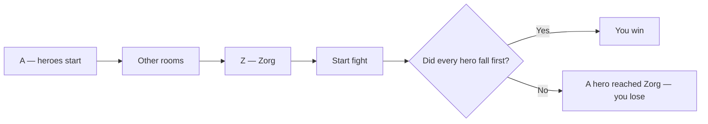
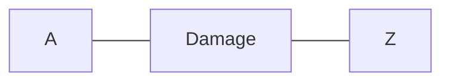
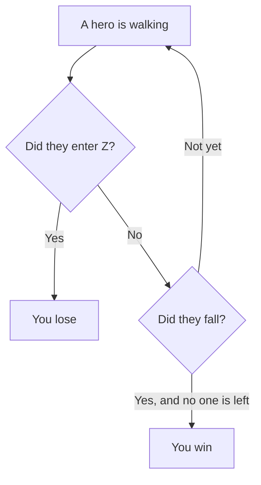

# Learn the rules

You build a dungeon for **Zorg**.

Heroes try to walk to Zorg's room.

You win if they **fall down before they get there**.

Play here: [zorg.artof.link](https://zorg.artof.link)



## Two jobs

**Job 1 — Place rooms.**
The level gives you tiles. You put every tile on the board.

**Job 2 — Start fight.**
Heroes walk by themselves. You watch. You may use a spell if you have one.

```mermaid
flowchart TD
  pick["Pick an easy level"] --> place["Place rooms so A connects toward Z"]
  place --> start["Press Start fight"]
  start --> watch["Heroes walk one at a time"]
  watch --> spell["Optional: use a spell once"]
  spell --> end["Win if they fall before Z"]
```

## How rooms stick together

- Rooms must share a **full side**. Corners do not count.
- Do not stack rooms on top of each other.
- A good first try: put **A**, then the other rooms, then **Z** in a line.



When the rooms make one connected dungeon, **Start fight** turns on.

## Room letters

These letters are on the tiles. They are the rooms the game already knows.

| Letter | Name | What happens |
|---|---|---|
| A | Start | Heroes appear here. |
| Z | Zorg | A hero who steps in ends the game. You lose. |
| D | Damage | Hurts a hero who enters. A negative number heals. |
| E | Element | Fire, water, ice, or poison on special cells. |
| P | Portal | Can jump a hero to a room they visited before. |
| O | Gold | The first hero in takes the coins. |
| T | Toll | Some cells cost gold to cross. |

Fire hurts a little. Water is a puddle you cannot stand in. Ice makes a hero slide. Poison helps once, then hurts a lot.

## Heroes walk themselves

You do **not** move the heroes.

They take turns. The first hero goes until they fall or get stuck. Then the next one goes.

They always follow their own plan. They do not roll dice.

- **Warrior** — takes the shortest walk to Zorg.
- **Elf** — looks for a safer walk and can ignore some elements.
- **Mechanic** — can shove a room into an empty space.
- **Gunner** — can shoot a Shell in a straight line.
- **Princess** — likes “important” rooms and can pull others that way.

A **Shell** flies until a wall or the edge. It can clear some danger cells. It can also hit heroes.

## Spells (optional)

Some levels give you spells. Each spell works **once**.

Use a spell **between** hero steps — not in the middle of a step.

- **Attack** — hurts heroes.
- **Teleport** — sends a hero back to an old room (or the waiting room).
- **Move** — slides the room a hero is in.
- **Swap** — trades two rooms.
- **Sleep / Wake** — a hero pauses, or wakes up.
- **Banality** — that hero starts acting like a Warrior.
- **Selection** — use another spell on more than one hero.

You can win many easy levels with **no spells at all**. Just place a mean path from A to Z.

## How you win

- **Win:** every hero falls down, and nobody entered Zorg's room.
- **Lose:** any hero steps into Z.

Try again if you lose. Change the path. Put more damage in the way.



## Ready?

1. Open [zorg.artof.link](https://zorg.artof.link).
2. Press **Start here — Difficulty 1**.
3. Place rooms so A points toward Z.
4. Press **Start fight**.

Want a longer grown-up guide? See the [[PLAYER_GUIDE|player guide]].

## Grown-up notes

You can skip this. It is for helpers and builders.

This page is a **companion**. If a sentence or a picture disagrees with [[GAME_SPEC]], the spec wins.

It only describes rules the engine already plays: rooms A / Z / D / E / P / O / T, the hero types above, and the one-time spells above.

It does **not** invent an extra room letter, extra Gunner shot-timing, or locked contracts.

Formal pointers (not needed to play): place rooms [[FR-5]] [[FR-6]] [[FR-7]] [[FR-8]]; spawn / Zorg / damage / elements / portals / gold / tolls [[FR-11]] [[FR-12]] [[FR-13]] [[FR-14]] [[FR-15]] [[FR-16]] [[FR-17]]; heroes [[FR-19]] [[FR-20]] [[FR-21]] [[FR-22]] [[FR-23]] [[FR-24]] [[FR-25]] [[FR-26]]; spells [[FR-32]] [[FR-33]] [[FR-34]] [[FR-35]] [[FR-36]] [[FR-37]] [[FR-39]] [[FR-40]] [[FR-41]] [[FR-42]]; win / lose idea [[FR-12]] [[FR-43]]. Maker playback still shows the fight result you see on screen.

More checklists: [[PLAYER_JOURNEYS|persona journeys]].
