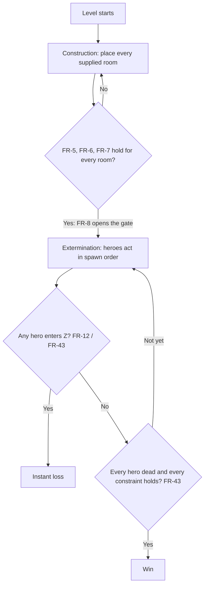
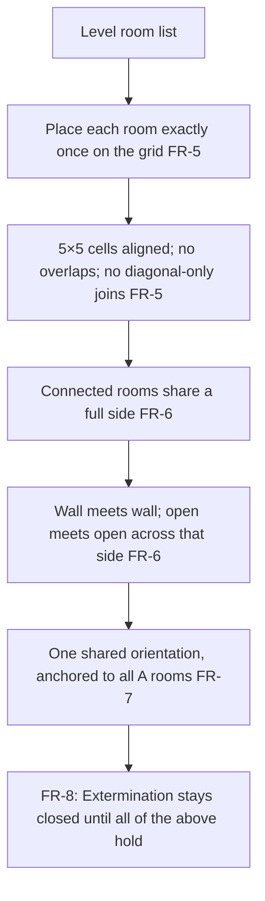
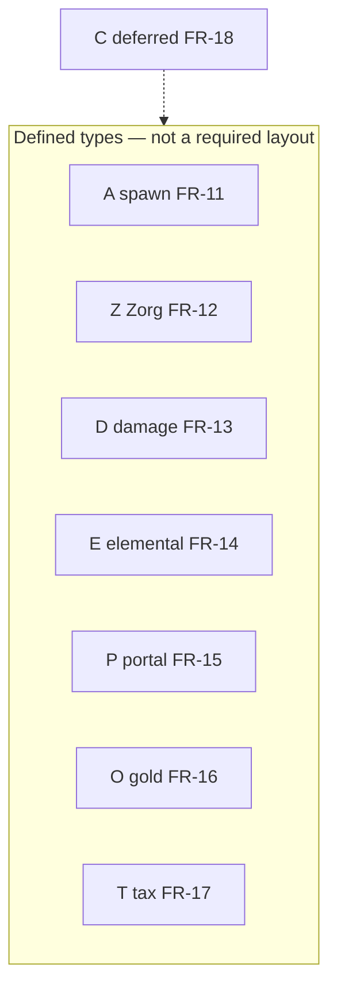
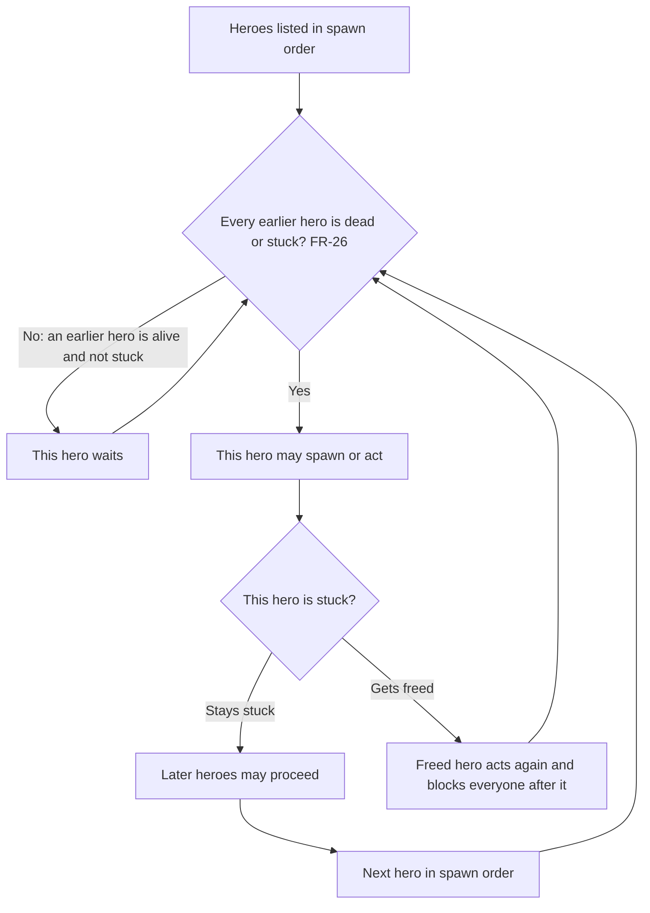
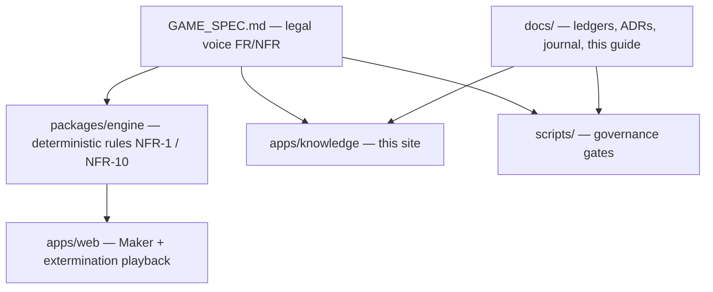

# Player & builder guide

This page is a **plain-English companion** to [[GAME_SPEC]]. It is not the legal voice. Formal IDs ([[FR-1]]–[[FR-46]], [[NFR-1]]–[[NFR-10]]) stay frozen in the spec. Every section below cites those IDs so you can jump to the rule that actually binds.

> [!IMPORTANT]
> If this English or a diagram disagrees with [[GAME_SPEC]], the spec wins. Do not invent room `C`, Gunner shot-duration, or contract gating ([[FR-18]], [[FR-22]], [[FR-4]]).

## Two phases: Construction, then Extermination

Every level is two jobs in a fixed order ([[FR-5]], [[FR-8]], [[FR-43]]).

1. **Construction (the Maker).** You place every room the level supplies on a grid and form one connected dungeon. No diagonals, no overlaps. You cannot start the fight until the layout is legal.
2. **Extermination.** Heroes spawn one at a time and walk toward Zorg by fixed, deterministic rules. You may spend one-time spells between finished actions. The run is won when every hero is dead and every stated constraint holds. It is lost the instant any hero enters Zorg's room.

What the gate actually checks before Extermination ([[FR-8]] wrapping [[FR-5]]–[[FR-7]]):

- Every supplied room is on the board exactly once, 5×5 cells aligned, no overlap, no diagonal-only touching ([[FR-5]]).
- Neighboring rooms share a **full side**, wall meeting wall and open cell meeting open cell ([[FR-6]]).
- Every room shares one orientation, taken from the `A` rooms' common hatch direction ([[FR-7]], [[NFR-6]]).

Win/loss is not “the last hero died” alone. Extra constraints and bonuses can sit on top ([[FR-43]], [[FR-44]]). Mirror worlds, if a level has them, are a later engine topic ([[FR-9]], [[FR-45]]) — this guide does not invent how they play.

## Rooms A / Z / D / E / P / O / T

A room is a 5×5 tile. The letters below are the types the spec defines. Cite the ID, not this paraphrase, when something looks off.

| Letter | Plain name | What it does in one sentence | Spec |
|---|---|---|---|
| `A` | Spawn | Heroes appear from the current main `A`. If several exist, you name a main at setup; any `A` a hero later walks through becomes the new main. All `A` rooms share one orientation. | [[FR-11]], [[FR-7]] |
| `Z` | Zorg | A hero stepping in ends the run immediately. | [[FR-12]], [[FR-43]] |
| `D(x)` | Damage | On every entry, apply `x` damage. Negative `x` heals. | [[FR-13]] |
| `E(elem)` | Elemental | Green cells follow fire / water / ice / poison. Immune heroes skip the cell entirely. | [[FR-14]] |
| `P(n, f)` | Portal | On the i-th entry (while `i ≤ n`), jump to the first cell of the hero's `f(i)`-th-most-recent room visit. If history is too short, back to the waiting room and respawn. | [[FR-15]] |
| `O(x)` | Gold | First hero in takes the pile. If that hero dies, the gold sticks to the death room (that room becomes an `O` too). Pickup runs before other entry effects. | [[FR-16]] |
| `T(x, elem)` | Tax | Dark cells behave like `E(elem)`. Light cells charge the oldest `x` gold the hero is carrying (refunded to the source rooms). A hero who cannot pay cannot step there; a shove onto an unpaid light cell is instant death. | [[FR-17]] |
| `C(…)` | Undefined | Used in the Artillery contract in the source manual. **No chapter defines it.** The loader may keep opaque arguments. Do not invent behavior. | [[FR-18]], [[NFR-8]] |

Element detail (still [[FR-14]], not new rules): fire deals 1 damage per entry; water is impassable and kills a non-immune hero who ends up on it; ice slides the hero until a wall stops them; poison is +1 HP on a cell's first visit and −3 HP every visit after.

### Placement at a glance

The letters are **types**, not a required path. A legal dungeon is one connected graph of whatever rooms the level listed ([[FR-5]], [[FR-6]]). Diagonals do not count. `C` is shown dashed because it is deferred.

`dist(r, s)` is Manhattan distance between placed rooms ([[FR-10]]). Levels can hang extra win conditions on those distances ([[FR-44]]).

## Heroes so far

Heroes are scripted, not players. They always see the dungeon (except other heroes, leftover spells, and what death would do) and they never roll dice ([[FR-19]], [[FR-29]], [[NFR-1]]).

**In the engine today, two types have rules encoded and tests:**

- **Warrior (`Warrior(x)`)** — `x` HP. Walks the shortest path to `Z`, ignoring how much HP that path would cost. Ties break right, then up, then left, then down ([[FR-20]], [[FR-31]]).
- **Elf (`Elf(x, elems)`)** — `x` HP, immune to the listed elements. Walks the shortest path to `Z` that keeps the most HP. Same tie order as the Warrior ([[FR-21]], [[FR-31]], [[FR-14]]).

**Later types exist in the spec only — this page does not invent their play.** When their phases land, read [[GAME_SPEC]] for Gunner + Shell ([[FR-22]], [[FR-23]]), Mechanic ([[FR-24]]), and Princess ([[FR-25]]). Gunner's optional third argument (shot duration) is still deferred ([[NFR-8]]).

Shared combat rules that already apply to every hero type ([[FR-26]]–[[FR-31]], [[FR-28]]):

- Only **one** hero is active. The next in spawn order waits until every earlier hero is dead or stuck. If a stuck earlier hero becomes free, that hero blocks everyone who spawned after them.
- Heroes do not collide and ignore each other's bodies (spells that name several heroes are the exception).
- At ≤0 HP a hero dies at once. They still *plan* as if they could never die.
- With no better path, a hero waits and re-checks when the dungeon changes.

Spells are all single-use and only legal between completed actions, never mid-teleport or mid-slide ([[FR-32]], [[FR-33]]). This guide does not walk the eight spell cards; see [[GAME_SPEC]] [[FR-32]]–[[FR-42]] when Phase 4 starts.

## How honesty works

The knowledge site is not allowed to say “this rule works” just because a page exists. [[STATUS_LEDGER]] is the claim table: one row per FR/NFR, and only five status words ([[AGENTS]] §2).

| Word | Meaning |
|---|---|
| `Unknown` | Not verified. Default until something real exists. |
| `Planned` | On the roadmap (a build-plan phase), not started. |
| `Simulated` | An automated deterministic test proves it. No live device run yet. |
| `Probed (YYYY-MM-DD)` | Checked against a real build or server on that date. |
| `Live & Probed` | Checked in production and still watched. |

Closing a ticket is not proof. A green deploy job is not `Live & Probed`. A sentence on this guide is not proof either. If a ledger row says `Simulated` or better, a test file under `packages/**` or `apps/**` must mention that ID. Known gaps stay explicit instead of guessed ([[NFR-8]]): room `C`, Gunner duration, and contract point-gating ([[FR-4]]) are still open.

When something the docs promised does not match the code, it is logged as a CF-NNN in [[FINDINGS]]. The second time the same miss happens, the fix must add a CI sensor or a test — not another “be careful” paragraph.

## Build plan phases 0–7

One shared model, two surfaces: a UI-free simulation library (`packages/engine`) and the Maker plus a thin extermination playback (`apps/web`). That split is what [[NFR-1]] and [[NFR-10]] are about. Do not read this table as “done.” Look at [[STATUS_LEDGER]] for what is actually proven.

| Phase | Focus | Covers |
|---|---|---|
| 0 | Data model and level loader | [[FR-1]]–[[FR-3]], [[NFR-2]], [[NFR-9]] |
| 1 | Maker MVP + Warrior; rooms A / Z / D | [[FR-5]]–[[FR-8]], [[FR-11]]–[[FR-13]], [[FR-20]], [[FR-26]]–[[FR-31]] |
| 2 | Elements and the Elf | [[FR-14]], [[FR-21]] |
| 3 | Portals, gold, and tolls | [[FR-15]]–[[FR-17]] |
| 4 | Spellbook (all eight, including Selection) | [[FR-32]]–[[FR-42]] |
| 5 | Remaining heroes — Mechanic, Gunner + Shell (duration first), Princess | [[FR-22]]–[[FR-25]] |
| 6 | Mirror worlds and solvability search | [[FR-9]], [[FR-45]], [[FR-46]], [[NFR-4]] |
| 7 | Content pack as fixtures; contract gating | [[FR-4]], [[NFR-5]] |

Phase 4+ is out of scope for this companion page. Phase 5 still waits on the Gunner duration question. Phase 7 still waits on how contract points are earned ([[FR-4]]).

## Repo layout

The monorepo matches [[0002-typescript-monorepo-2d-to-3d]]: rules live in a pure TypeScript engine; the Maker is a 2D canvas app that must not grow its own game logic.

