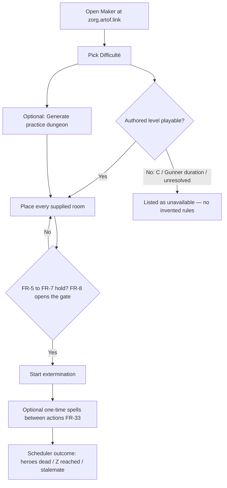
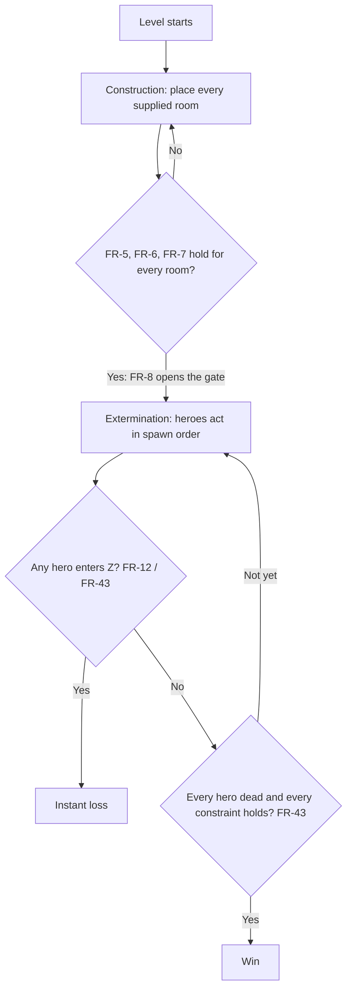
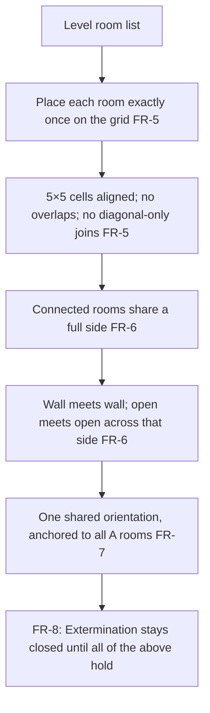
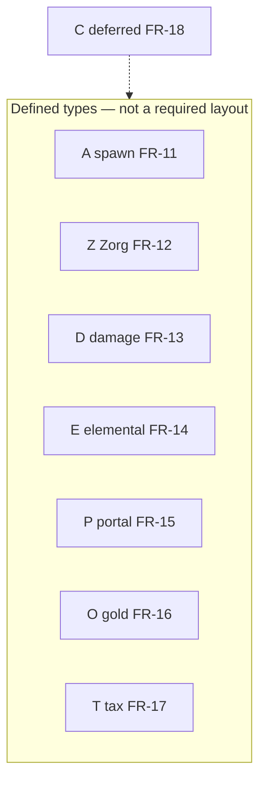
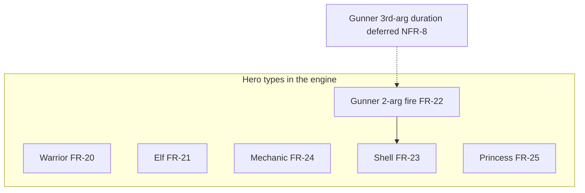
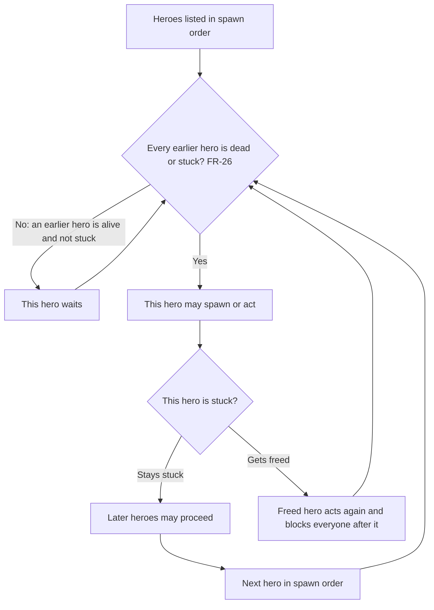
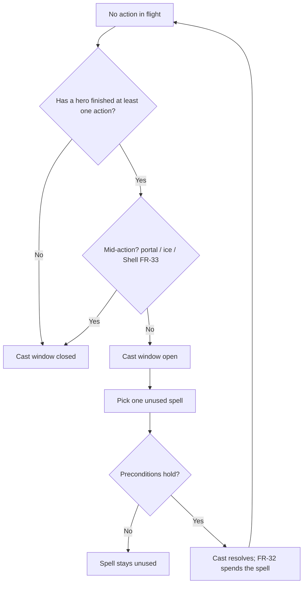
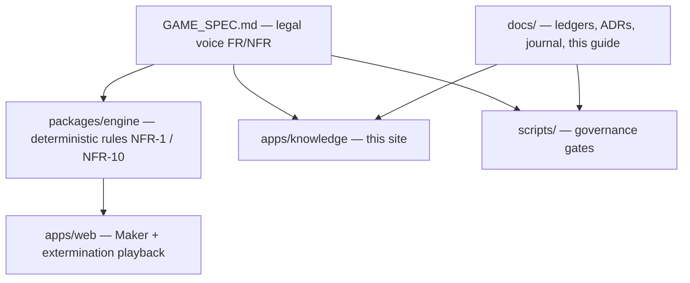

# Player & builder guide

This page is a **plain-English companion** to [[GAME_SPEC]]. It is not the legal voice. Formal IDs ([[FR-1]]–[[FR-46]], [[NFR-1]]–[[NFR-10]]) stay frozen in the spec. Every section below cites those IDs so you can jump to the rule that actually binds.

> [!IMPORTANT]
> If this English or a diagram disagrees with [[GAME_SPEC]], the spec wins. Do not invent room `C`, Gunner shot-duration, or contract gating ([[FR-18]], [[FR-22]], [[FR-4]]).

Play the authored campaign in the Maker: [https://zorg.artof.link](https://zorg.artof.link).

## How to play the campaign

The public Maker is a **campaign browser first**. You pick an authored level, place its rooms, then watch the fight. After that, a **Generate** control can roll a practice dungeon for the same numeric Difficulté bands.

1. Open the Maker at [https://zorg.artof.link](https://zorg.artof.link).
2. Pick a **Difficulté** band (the author's difficulty number). Deluxe contract levels with no Difficulté line sit in a **No Difficulté** band; you can also filter by contract name.
3. Open a **playable** authored level. Place every room that level supplies on the grid so they form one legal dungeon ([[FR-5]]–[[FR-8]]).
4. Start **extermination**. Heroes walk by their own fixed rules. You may spend leftover one-time spells between finished actions ([[FR-32]], [[FR-33]]).
5. Optional: use **Generate a practice dungeon** (Difficulté 1–4) or **Regenerate** on a generated level. Authored campaign stays the default.

**Honest limits of this slice** (see [[STATUS_LEDGER]]):

- Engine proof is **Simulated** (automated tests). It is **not** Live & Probed.
- Win/loss in the Maker playback is still the **scheduler** result: every hero dead, a hero reached `Z`, or nothing further changes. The engine’s `scoreLevel` layer ([[FR-43]], [[FR-44]], Simulated) aggregates worlds and grounded constraints; this view does not call it. Opaque authored prose stays unevaluated ([[0006-grounded-constraint-evaluation]]).
- Contract point costs are flavour text. [[FR-4]] gating (earn / spend points to unlock contracts) is **not** built.
- **Unavailable** levels stay listed but not selectable: opaque `C` rooms ([[FR-18]]), Gunner with a third duration argument (parsed, not played — [[NFR-8]]), or unresolved authored tokens. Quarantine fixtures (including N11 Dream Trap and N18 Math Bath) and Blabla contracts 11–15 are omitted from the list entirely ([[FINDINGS]] CF-005).
- **Generated** levels are Simulated engine output (`generateLevel`: parse + legal placement + bounded [[FR-46]] search). They are **not** a live production probe. They do not unlock contracts ([[FR-4]] still not gating). See [[0005-level-generator]].

## Generated practice dungeons

The generator is additive. It does not replace the authored pack ([[NFR-5]]).

What it **does** guarantee (engine tests, not a live probe):

- Only rooms / heroes / spells the engine already implements. No `C`, no Gunner (so no duration argument), no choix, no mirrors.
- A connected Maker layout (A present, [[FR-5]]–[[FR-8]]).
- Difficulté bands **1–4**, with room / hero / spell knobs inside the authored fixture envelopes for that number. Harder bands add more pieces and E/O flavour; they do not invent a new scale.
- Typical output is **solvable** under the bounded [[FR-46]] search: an A → lethal D → Z corridor. This slice does not emit not-solvable mirror worlds.

What it **does not** do: earn or spend contract points, encode Gunner duration, define room `C`, or claim Live & Probed. Formal IDs stay in [[GAME_SPEC]].

## Two phases: Construction, then Extermination

Every level is two jobs in a fixed order ([[FR-5]], [[FR-8]], [[FR-43]]).

1. **Construction (the Maker).** You place every room the level supplies on a grid and form one connected dungeon. No diagonals, no overlaps. You cannot start the fight until the layout is legal.
2. **Extermination.** Heroes spawn one at a time and walk toward Zorg by fixed, deterministic rules. You may spend one-time spells between finished actions. The run is won when every hero is dead and every stated constraint holds. It is lost the instant any hero enters Zorg's room.

What the gate actually checks before Extermination ([[FR-8]] wrapping [[FR-5]]–[[FR-7]]):

- Every supplied room is on the board exactly once, 5×5 cells aligned, no overlap, no diagonal-only touching ([[FR-5]]).
- Neighboring rooms share a **full side**, wall meeting wall and open cell meeting open cell ([[FR-6]]).
- Every room shares one orientation, taken from the `A` rooms' common wall-hatch direction ([[FR-7]], [[NFR-6]]).
- The Maker draws that wall-hatch as a bright arrow on each placed room, on the selected tray room, and as a ghost on the cell you are about to drop onto ([[NFR-6]]). The default tile still has a hatch on every side so seams can match ([[FR-6]]); the arrow is the shared [[FR-7]] direction, not extra geometry.

Win/loss is not “the last hero died” alone. Extra constraints and bonuses can sit on top ([[FR-43]], [[FR-44]]). Mirror worlds share the constructed room graph and swap rooms 1:1 by declaration order ([[FR-9]]). Worlds resolve normal → M′ → M″ and retire when idle or when that world's Z is reached ([[FR-45]]). Whether a world is solvable is a bounded engine search ([[FR-46]], [[NFR-4]]). The engine scores a grounded subset of those extras (`scoreLevel`: any-world Z is a loss; win needs every world’s heroes dead and every blocking constraint held; bonuses are tracked separately and never block). Authored lines the spec does not define stay `unsupported` and refuse a win claim — the engine does not invent a constraint language ([[0006-grounded-constraint-evaluation]], [[NFR-8]]). Maker playback still shows only the scheduler outcome. If this paragraph and [[GAME_SPEC]] disagree, the spec wins.

## Rooms A / Z / D / E / P / O / T

A room is a 5×5 tile. The letters below are the types the spec defines. Cite the ID, not this paraphrase, when something looks off. Portals, gold, and tolls ([[FR-15]]–[[FR-17]]) are in the engine today.

| Letter | Plain name | What it does in one sentence | Spec |
|---|---|---|---|
| `A` | Spawn | Heroes appear from the current main `A`. If several exist, you name a main at setup; any `A` a hero later walks through becomes the new main. All `A` rooms share one orientation. | [[FR-11]], [[FR-7]] |
| `Z` | Zorg | A hero stepping in ends the run immediately. | [[FR-12]], [[FR-43]] |
| `D(x)` | Damage | On every entry, apply `x` damage. Negative `x` heals. | [[FR-13]] |
| `E(elem)` | Elemental | Green cells follow fire / water / ice / poison. Immune heroes skip the cell entirely. | [[FR-14]] |
| `P(n, f)` | Portal | On the i-th entry (while `i ≤ n`), jump to the first cell of the hero's `f(i)`-th-most-recent room visit. If history is too short, back to the waiting room and respawn. | [[FR-15]] |
| `O(x)` | Gold | First hero in takes the pile. If that hero dies, the gold sticks to the death room (that room becomes an `O` too). Pickup runs before other entry effects. | [[FR-16]] |
| `T(x, elem)` | Tax | Dark cells behave like `E(elem)`. Light cells charge the oldest `x` gold the hero is carrying (refunded to the source rooms). A hero who cannot pay cannot step there; a shove onto an unpaid light cell is instant death. | [[FR-17]] |
| `C(…)` | Undefined | Used in the Artillery contract in the source manual. **No chapter defines it.** The loader may keep opaque arguments. Do not invent behavior. Campaign levels that contain `C` stay unavailable. | [[FR-18]], [[NFR-8]] |

Element detail (still [[FR-14]], not new rules): fire deals 1 damage per entry; water is impassable and kills a non-immune hero who ends up on it; ice slides the hero until a wall stops them; poison is +1 HP on a cell's first visit and −3 HP every visit after.

### Placement at a glance

The letters are **types**, not a required path. A legal dungeon is one connected graph of whatever rooms the level listed ([[FR-5]], [[FR-6]]). Diagonals do not count. `C` is shown dashed because it is deferred.

`dist(r, s)` is Manhattan distance between placed rooms ([[FR-10]]). Levels can hang extra win conditions on those distances ([[FR-44]]).

## Heroes in the engine

Heroes are scripted, not players. They always see the dungeon (except other heroes, leftover spells, and what death would do) and they never roll dice ([[FR-19]], [[FR-29]], [[NFR-1]]).

**These types have rules encoded and tests.** This page does not invent deferred Gunner duration.

| Type | Plain read | Spec |
|---|---|---|
| Warrior (`Warrior(x)`) | `x` HP. Shortest path to `Z`, ignoring how much HP that path would cost. Ties break right, then up, then left, then down. | [[FR-20]], [[FR-31]] |
| Elf (`Elf(x, elems)`) | `x` HP, immune to the listed elements. Shortest path to `Z` that keeps the most HP. Same tie order as the Warrior. | [[FR-21]], [[FR-31]], [[FR-14]] |
| Mechanic (`Mechanic(x, dict)`) | Shortest path to its weight target (usually `Z`), ignoring HP, using shove power; then fewest unjustified shoves. From a listed room it can shove that room one adjacent empty cell. | [[FR-24]] |
| Gunner (`Gunner(x, c)`) | Fire a useful Shell soonest, then HP-preserving path factoring shots, up to `c` shots (`inf` = no cap). Same tie order as the Warrior. | [[FR-22]] |
| Shell | Instant cardinal projectile. Stops at a wall or the dungeon edge. Clears elemental cells and live `D` monsters; 2 damage to heroes it crosses. Other action pauses for the shot. | [[FR-23]] |
| Princess (`Princess(x, dict, b)`) | Rooms get a perceived weight; every hero is pulled. Then HP-preserving shortest path to the highest-weight reachable room. | [[FR-25]] |

**Still deferred — do not invent play for these:**

- Gunner's optional third argument (shot duration) is parse-accepted and stored. It is **never read**. Levels that author that third argument stay unavailable ([[FR-22]], [[NFR-8]]).
- Shell clearing `Z` as a “monster” is **not** encoded. Entering `Z` is still an instant loss ([[FR-12]]).

Shared combat rules that already apply to every hero type ([[FR-26]]–[[FR-31]], [[FR-28]]):

- Only **one** hero is active. The next in spawn order waits until every earlier hero is dead or stuck. If a stuck earlier hero becomes free, that hero blocks everyone who spawned after them.
- Heroes do not collide and ignore each other's bodies (spells that name several heroes are the exception).
- At ≤0 HP a hero dies at once. They still *plan* as if they could never die.
- With no better path, a hero waits and re-checks when the dungeon changes.

## Spells (one-time, between actions)

All eight spell cards are encoded ([[FR-32]]–[[FR-42]]). Each is single-use. You may cast only between **completed** hero actions — never mid-teleport, mid-slide, or mid-Shell ([[FR-33]]). Casting a hero-targeted spell with no active hero is illegal. Cite the spec for exact targeting; this table is a companion.

| Spell | Plain read | Spec |
|---|---|---|
| `Attack(x)` | `x` damage to every living hero, or a Selection subset. | [[FR-34]] |
| `Teleport(n)` | Move the active (or selected) hero to the first cell of their `n`-th-most-recent room visit. History too short → waiting room. | [[FR-35]] |
| `Move()` | Relocate the active hero's room onto an empty cell. Contents travel. Seams are re-checked. | [[FR-36]], [[FR-38]] |
| `Swap()` | Swap the active hero's room with another. Contents travel. Seams are re-checked. | [[FR-37]], [[FR-38]] |
| `Selection(allow_corpses)` | Pick heroes plus one other unused spell and apply that spell to all of them. Only the four spells that have a documented variant. | [[FR-39]] |
| `Sleep()` | Chosen awake hero cannot act until woken or its HP changes. | [[FR-40]] |
| `Wake()` | Chosen sleeping hero wakes. | [[FR-41]] |
| `Banality` | Chosen hero becomes a Warrior, keeping current HP. | [[FR-42]] |

A successful cast **spends** that card forever ([[FR-32]]). A rejected cast (illegal target, mid-action, broken seams after Move/Swap) spends nothing.

## How honesty works

The knowledge site is not allowed to say “this rule works” just because a page exists. [[STATUS_LEDGER]] is the claim table: one row per FR/NFR, and only five status words ([[AGENTS]] §2).

| Word | Meaning |
|---|---|
| `Unknown` | Not verified. Default until something real exists. |
| `Planned` | On the roadmap (a build-plan phase), not started. |
| `Simulated` | An automated deterministic test proves it. No live device run yet. |
| `Probed (YYYY-MM-DD)` | Checked against a real build or server on that date. |
| `Live & Probed` | Checked in production and still watched. |

Closing a ticket is not proof. A green deploy job is not `Live & Probed`. A sentence on this guide is not proof either. If a ledger row says `Simulated` or better, a test file under `packages/**` or `apps/**` must mention that ID. Known gaps stay explicit instead of guessed ([[NFR-8]]): room `C`, Gunner duration, and contract point-gating ([[FR-4]]) are still open.

When something the docs promised does not match the code, it is logged as a CF-NNN in [[FINDINGS]]. The second time the same miss happens, the fix must add a CI sensor or a test — not another “be careful” paragraph.

## Build plan phases 0–7

One shared model, two surfaces: a UI-free simulation library (`packages/engine`) and the Maker plus a thin extermination playback (`apps/web`). That split is what [[NFR-1]] and [[NFR-10]] are about. Do not read this table as “done.” Look at [[STATUS_LEDGER]] for what is actually proven.

| Phase | Focus | Covers |
|---|---|---|
| 0 | Data model and level loader | [[FR-1]]–[[FR-3]], [[NFR-2]], [[NFR-9]] |
| 1 | Maker MVP + Warrior; rooms A / Z / D | [[FR-5]]–[[FR-8]], [[FR-11]]–[[FR-13]], [[FR-20]], [[FR-26]]–[[FR-31]] |
| 2 | Elements and the Elf | [[FR-14]], [[FR-21]] |
| 3 | Portals, gold, and tolls | [[FR-15]]–[[FR-17]] |
| 4 | Spellbook (all eight, including Selection) | [[FR-32]]–[[FR-42]] |
| 5 | Remaining heroes — Mechanic, Gunner + Shell, Princess (duration deferred) | [[FR-22]]–[[FR-25]] |
| 6 | Mirror worlds and solvability search | [[FR-9]], [[FR-45]], [[FR-46]], [[NFR-4]] |
| 7 | Content pack as fixtures; contract grouping as data (gating still open) | [[FR-4]], [[NFR-5]] |

Engine work for phases 0–7 has landed on `main`. The authored pack is imported as fixtures; parse-regression covers the green corpus ([[NFR-5]]). The Maker campaigns those fixtures by Difficulté, then offers an optional generator for bands 1–4 ([[0005-level-generator]]). [[FR-4]] point-gating, room `C`, and Gunner shot-duration stay open ([[NFR-8]]). Companion prose is not proof — the ledger is.

## Repo layout

The monorepo matches [[0002-typescript-monorepo-2d-to-3d]]: rules live in a pure TypeScript engine; the Maker is a 2D canvas app that must not grow its own game logic. The knowledge site explains; it does not decide.

