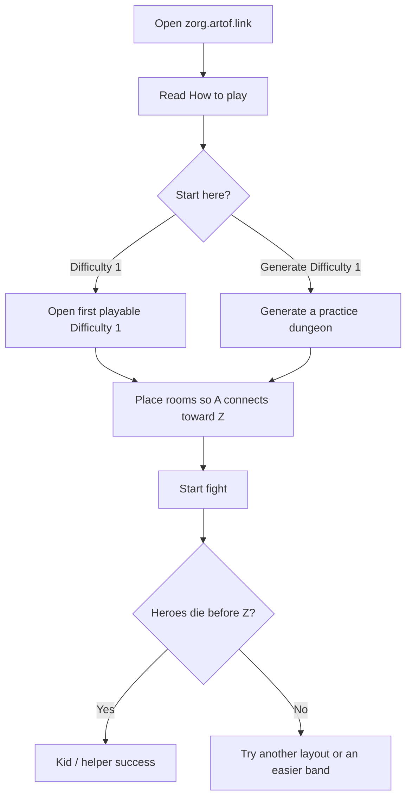

# Persona journeys (UX validation)

These journeys are **validation use cases** for the Maker at [https://zorg.artof.link](https://zorg.artof.link). They are not new game rules.

> [!IMPORTANT]
> Formal rules stay in [[GAME_SPEC]]. If a journey, a button label, or this page disagrees with the spec, **the spec wins**. Do not invent room `C`, Gunner shot-duration, or contract gating ([[FR-18]], [[FR-22]], [[FR-4]]).

The authored campaign and the Difficulté / **Difficulty** bands are the same numbers the fixtures already use. **Difficulty** is the kid-facing English word; **Difficulté** is the source label (kept as a secondary / bilingual hint). Engine proof in [[STATUS_LEDGER]] is still Simulated, not Live & Probed.

Companion how-to: [[LEARN]] (kid pictures) and [[PLAYER_GUIDE]] (full companion). First-timer gap that started this work: [[FINDINGS]] CF-009.

## How to use these journeys

1. Treat each `J-*` id as a stable checklist, not a feature request to invent rules.
2. Run the **manual** checklist on the live Maker or a local `apps/web` build.

3. Optional **automated probes** (Playwright under `apps/web/e2e/journeys.spec.ts`, `pnpm probe:journeys`) assert the same success criteria. They are **Simulated** evidence for the journeys — not Live & Probed and not a [[STATUS_LEDGER]] promotion. An optional **FR locale** smoke (`?lang=fr`) checks How to play / Start here labels in French; it is UX validation only — [[GAME_SPEC]] still wins on rules ([[0007-i18n-fr-en]]).
4. A journey can fail UX and still be rules-correct. That is a Maker problem, not an engine FR.

## Index

| ID | Persona | Primary surface |
|---|---|---|
| J-KID | Kid first-timer (≈8) | Landing + first fight |
| J-HELPER | Grown-up helper | How to play + what success looks like |
| J-CAMPAIGN | Campaign puzzle player | Authored Difficulty progression |
| J-PRACTICE | Practice generator player | Generate → fight quickly |
| J-HONESTY | Honesty / engineer | Collapsed ledger / FR notes |

---

## J-KID: Kid first-timer (≈8)

Never played. Needs plain English, **one obvious next step**, and no engineer jargon on the first screen.

### Goal

Play one easy dungeon and understand win vs loss without asking an adult to decode FR / C-room / ledger language.

### Happy path

1. Open [https://zorg.artof.link](https://zorg.artof.link).
2. Read **How to play** (four short steps).
3. Press **Start here — Difficulty 1** *or* **Start here — Generate Difficulty 1**.
4. Place rooms so **A** (heroes start) connects toward **Z** (Zorg). A line is fine.
5. Press **Start fight**.
6. Watch. You win if the heroes die before anyone enters Z. You lose if a hero reaches Z.

### Success criteria

- The first screen leads with How to play and a Start here button, not FR-4 / C / Gunner duration / ledger prose.
- The child can name the next tap without reading a paragraph.
- After one fight, the child can say “heroes must fall before Zorg” in their own words.
- Engineer notes stay behind a disclosure.

### Validation checklist (manual)

- [ ] Landing heading is the game name; lede is plain English.
- [ ] How to play lists: pick easy / Generate → place A toward Z → Start fight → heroes die before Z.
- [ ] **Learn the rules** opens the kid page (`learn.html`) with pictures and no FR soup on the first screen.
- [ ] **Start here — Difficulty 1** opens a playable authored Difficulty 1 level.
- [ ] **Start here — Generate Difficulty 1** opens a generated practice dungeon.
- [ ] First playable Difficulty 1 card is marked Start here when that band is showing.
- [ ] Honesty / FR / C / Gunner / Simulated notes are inside a collapsed details block.
- [ ] Maker reminder still says place A toward Z, then Start fight.
- [ ] Loss/win banners are readable without “scheduler” as the first word.

### Automated probes (Simulated)

Covered by `apps/web/e2e/journeys.spec.ts` (issue #46):

- Query landing for How to play steps and both Start here labels.
- Kid-facing copy blob contains no `FR-4`, `C room`, `Gunner duration`, or `ledger`.
- Click Start here Difficulty 1 → Maker title is a playable catalog name.
- Click Start here Generate Difficulty 1 → generated pack, Start fight can enable after a legal layout (or “Place rooms in a line”).

---

## J-HELPER: Grown-up helper

Helps the kid. Needs a short “how to play” and a sentence for what success looks like. Does not need the full spec.

### Goal

Coach a first run in under a minute: what to tap, what “winning” means, where to go for depth.

### Happy path

1. Open the Maker with the kid.
2. Read How to play together (or the helper blurb under it).
3. Use **Start here — Difficulty 1** (authored) unless the kid wants a fresh map — then Generate.
4. If rooms look messy, use **Place rooms in a line**.
5. Start fight. Explain: heroes walk by themselves; stop them before Zorg’s room.
6. For more detail, open the knowledge [Player & builder guide](https://knowledge.zorg.artof.link/guide.html).

### Success criteria

- Helper can explain success in one sentence: every hero dies before anyone enters Zorg’s room.
- Helper can find the longer guide without hunting FR ids.
- Unavailable / unfinished levels are not the default list.

### Validation checklist (manual)

- [ ] Helper blurb is visible near How to play.
- [ ] **Learn the rules** is the first extra link on How to play (pictures).
- [ ] Knowledge guide link is on the landing How to play panel.
- [ ] “Show unfinished levels” is off by default.
- [ ] Place rooms in a line still exists on the Maker (helper rescue).
- [ ] Guide / this journeys page say the spec wins if English disagrees.

### Automated probes (Simulated)

Landing unfinished-toggle default is covered by the e2e suite. Still useful:

- Landing contains the helper success sentence and the knowledge guide href.
- Unavailable toggle default is unchecked.

---

## J-CAMPAIGN: Campaign puzzle player

Wants the authored pack in Difficulty order (the author’s Difficulté numbers). Generate is optional, not the default.

### Goal

Browse Difficulty 1 → 2 → 3 → 4, open a playable authored level, build a legal dungeon, fight.

### Happy path

1. Open the Maker (campaign is the default list).
2. Choose a **Difficulty** band (Difficulté shown as the source word).
3. Optionally filter by contract name (points are labels only — [[FR-4]] is not gating).
4. Open a playable card. Place every supplied room ([[FR-5]]–[[FR-8]]).
5. Start fight. Spend leftover one-time spells between finished actions ([[FR-32]], [[FR-33]]).
6. Return to campaign and step up a band.

### Success criteria

- Authored catalog remains the default, not the generator.
- Bands match fixture Difficulté numbers 1–4, plus a “No Difficulty” bucket for levels with no number.
- Unavailable authored levels stay listed but not selectable when the unfinished toggle is on (C / Gunner duration / unresolved — no invented rules).

### Validation checklist (manual)

- [ ] Difficulty chips exist for 1–4 and No Difficulty (no Difficulté).
- [ ] Opening an authored card does not pre-fill a generated corridor (empty / player-placed board).
- [ ] Contract filter does not lock levels.
- [ ] Quarantine / Blabla contracts 11–15 stay omitted ([[FINDINGS]] CF-005).

### Automated probes (Simulated)

Authored-default + unfinished-off are covered by the e2e suite. Still useful:

- Default view is authored catalog, band 1 selected when present.
- Generated pack is absent from the authored grid.
- A known C-room / Gunner-duration id is disabled when unfinished levels are shown.

---

## J-PRACTICE: Practice generator player

Wants Generate → fight quickly. Authored campaign stays available.

### Goal

Roll a Difficulty 1–4 practice dungeon, place (or accept the suggested line), fight, optionally Regenerate.

### Happy path

1. On landing, use **Start here — Generate Difficulty 1** or the Generate panel.
2. Pick Difficulty 2–4 in that panel when ready for more pieces.
3. Place rooms (suggested A–Z corridor may already be on the board).
4. Start fight.
5. Regenerate for another seed of the same band.

### Success criteria

- Generate is one or two taps from landing.
- Output stays inside engine-implemented types (no `C`, no Gunner duration, no contract unlock) — [[0005-level-generator]].
- Copy does not claim Live & Probed.

### Validation checklist (manual)

- [ ] Generate Difficulty 1–4 controls exist below the campaign.
- [ ] Start here Generate Difficulty 1 uses band 1.
- [ ] Maker shows a generated hint and a Regenerate control.
- [ ] Honesty details still say generated = Simulated engine output.

### Automated probes (Simulated)

Start-here Generate → `pack === "generated"` band 1 is covered by the e2e suite. Still useful:

- Generate Difficulty 1 → `pack === "generated"` and `difficultyBand === "1"`.
- Regenerating changes seed / layout without leaving the Maker.

---

## J-HONESTY: Honesty / engineer

Comfortable with FR / ledger language. That language may stay **collapsed / secondary**.

### Goal

Inspect Simulated vs live claims, unavailable reasons, and deferred rules without blocking first-timers.

### Happy path

1. Open the landing disclosure **Engineer / honesty notes**.
2. Confirm: Simulated tests, not a live production probe; [[FR-4]] not built; `C` and Gunner duration stay unavailable; generated ≠ live probe.
3. Optionally show unfinished levels and read the reason chips.
4. Cross-check [[STATUS_LEDGER]], [[FINDINGS]], and [[PLAYER_GUIDE]].

### Success criteria

- Honesty content is still present (not deleted).
- It is not the first paragraph a kid must read.
- No invented FR-4 / C / Gunner duration behavior.

### Validation checklist (manual)

- [ ] Details block contains FR-4, C rooms, Gunner duration, Simulated, generated-not-live.
- [ ] Unfinished toggle still exposes unavailable reason text.
- [ ] Knowledge honesty ledger remains linked from the disclosure or the knowledge site.

### Automated probes (Simulated)

Honesty disclosure contents (Simulated / FR-4 / C / Gunner) are covered by the e2e suite. Still useful:

- Disclosure inner text matches the first-run honesty details string.
- Kid-facing string blob still excludes those terms.

---

## Mapping to rules (read-only)

Journeys cite IDs so reviewers can jump to the rule. They do not change status in [[STATUS_LEDGER]].

| Journey | Spec / docs to keep in view |
|---|---|
| J-KID / J-HELPER | [[FR-5]]–[[FR-8]], [[FR-12]], [[FR-43]] (win/loss idea); Maker playback is still scheduler-only — see [[PLAYER_GUIDE]] |
| J-CAMPAIGN | Authored catalog, Difficulté bands, no [[FR-4]] gating |
| J-PRACTICE | [[0005-level-generator]], [[FR-46]] / [[NFR-4]] as Simulated generator proof |
| J-HONESTY | [[STATUS_LEDGER]], [[NFR-8]], [[FR-18]], Gunner duration deferral |

## Out of scope for this file

- Inventing `C`, Gunner duration, or earn/spend contracts.
- Claiming Live & Probed because a human clicked through a journey.
- Replacing [[PLAYER_GUIDE]] or [[GAME_SPEC]].
