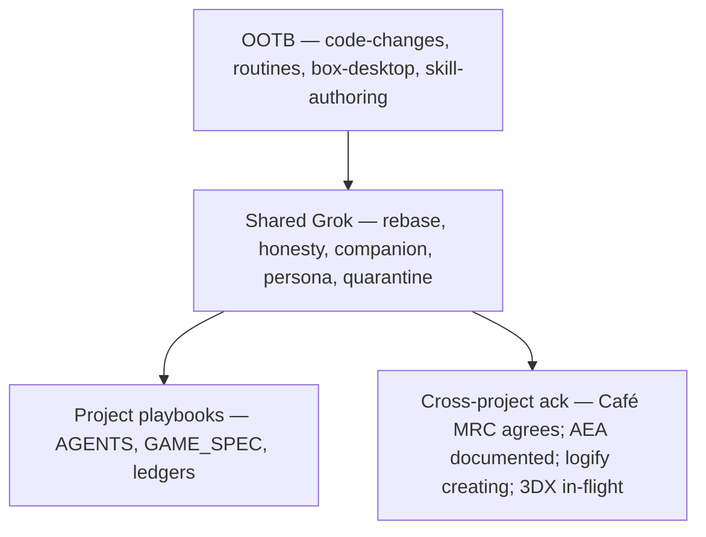

# Skill matrix (2026-09 retrospective)

One table shape everywhere: **Skill | Scope | Why? (historical evidence) | What (recipe / responsibility)**.

This page is a map, not a new game rule and not a [[STATUS_LEDGER]] promotion. Formal IDs stay in [[GAME_SPEC]]. **Keep Learning and Apply** ([AEA #434](https://gitlab.com/artof-group/adaptive-experience-architecture/-/work_items/434), open [!513](https://gitlab.com/artof-group/adaptive-experience-architecture/-/merge_requests/513)): when the build teaches something, write it into the harness before the next loop. Complements Honesty and Knowledge First; **not** Antifragility. Status here: **Documented / Planned**. Knowledge Pages: **Unknown** until AEA probes. Do not treat !513 as merged.

AEA skill-matrix source (merged [!512](https://gitlab.com/artof-group/adaptive-experience-architecture/-/merge_requests/512), closes [#433](https://gitlab.com/artof-group/adaptive-experience-architecture/-/work_items/433)): [`research/random-thoughts/2026-09-12-session-memory-log-aea-grok-skill-matrix.md`](https://gitlab.com/artof-group/adaptive-experience-architecture/-/blob/main/research/random-thoughts/2026-09-12-session-memory-log-aea-grok-skill-matrix.md).

Zorg issues (opened):
- [Adopt shared skill matrix #50](https://github.com/artofdream/zorg-dungeon/issues/50)
- [Kid visual rules / learn page #51](https://github.com/artofdream/zorg-dungeon/issues/51)
- [Corpus quarantine honesty #52](https://github.com/artofdream/zorg-dungeon/issues/52)
- [Keep Learning and Apply #53](https://github.com/artofdream/zorg-dungeon/issues/53)
- First-play / journey UX: [#36](https://github.com/artofdream/zorg-dungeon/issues/36)–[#48](https://github.com/artofdream/zorg-dungeon/issues/48) (audit also filed [#30](https://github.com/artofdream/zorg-dungeon/issues/30)–[#35](https://github.com/artofdream/zorg-dungeon/issues/35))

Sand-workflow **URLs** — paste in a follow-up; slugs below are the library names. Do not invent ids.

Kid-rules work (PR #44 / [#51](https://github.com/artofdream/zorg-dungeon/issues/51)) should **compose** with this page. Do not rewrite that copy here.



## Loaded on this repo

| Skill | Scope | Why? (historical evidence) | What (recipe / responsibility) |
|---|---|---|---|
| `code-changes` | OOTB / managed | Used for every phase 0–7 slice, the Difficulté generator, campaign, and Maker UX. | Load for any cloud-first edit to this tree (engine, Maker, knowledge, docs, CI). |
| `routines` | OOTB / managed | AFK parallel PRs went red with no one watching. | Babysit open PRs / CI after the producer steps away. |
| `box-desktop` | OOTB / managed | 2026-09-12 first-play audit produced [#30](https://github.com/artofdream/zorg-dungeon/issues/30)–[#48](https://github.com/artofdream/zorg-dungeon/issues/48). | Live audit of [zorg.artof.link](https://zorg.artof.link). A knowledge screenshot is not that audit. |
| `skill-authoring` | OOTB / managed | Rebase / honesty / companion / kid misses kept coming back as paragraphs. | After a miss repeats, save a recipe. This page is the map. |
| `pr-train-rebase` | Shared Grok skill · sand-workflow `pr-train-rebase` | [#23](https://github.com/artofdream/zorg-dungeon/pull/23) / [#24](https://github.com/artofdream/zorg-dungeon/pull/24) / [#25](https://github.com/artofdream/zorg-dungeon/pull/25) CONFLICTING after earlier merges. | Before stacking parallel cloud PRs: rebase onto latest `main`; do not rewrite a peer's ledger rows. Adoption: [#50](https://github.com/artofdream/zorg-dungeon/issues/50). |
| `honesty-ledger-gate` | Shared Grok skill · sand-workflow `honesty-ledger-gate` | S2–S6 deferrals. Invented `C` / Gunner duration / [[FR-4]] would be a lie. | Before any status word: five-word vocabulary; evidence or `Unknown`. Never invent those deferred rules. Adoption: [#50](https://github.com/artofdream/zorg-dungeon/issues/50). |
| `companion-plain-docs` | Shared Grok skill · sand-workflow `companion-plain-docs` | CF-007: [[PLAYER_GUIDE]] still said only Warrior/Elf after phases 4–7. | Plain English + mermaid on [knowledge.zorg.artof.link](https://knowledge.zorg.artof.link). [[GAME_SPEC]] wins. Adoption: [#50](https://github.com/artofdream/zorg-dungeon/issues/50). |
| `persona-journey-validation` | Shared Grok skill · sand-workflow `persona-journey-validation` | ~8yo first-play audit; standing personas; UX issues [#36](https://github.com/artofdream/zorg-dungeon/issues/36)–[#48](https://github.com/artofdream/zorg-dungeon/issues/48) (also [#30](https://github.com/artofdream/zorg-dungeon/issues/30)–[#35](https://github.com/artofdream/zorg-dungeon/issues/35)). | Live Maker audit → named personas → issues → fix. Compose with [#51](https://github.com/artofdream/zorg-dungeon/issues/51). Adoption: [#50](https://github.com/artofdream/zorg-dungeon/issues/50). |
| `corpus-quarantine-honesty` | Shared Grok skill · sand-workflow `corpus-quarantine-honesty` · **created** (zorg-evidenced) | CF-005 N11 / N18; S5; green corpus must not silently include broken levels. Tracked: [#52](https://github.com/artofdream/zorg-dungeon/issues/52). | Quarantine paths, CI skip, [[FINDINGS]] link. Never promote an NFR on quarantined fixtures. Adoption: [#50](https://github.com/artofdream/zorg-dungeon/issues/50). |
| [[AGENTS]] | Project playbook | Multi-agent chat amnesia and tool-specific drift. | First file every session. Producer does not merge (S7). |
| [[GAME_SPEC]] | Project playbook | Companion prose drifting from rules. | Source of truth. IDs frozen. A companion sentence never overrides it. |
| [[STATUS_LEDGER]] | Project playbook | Status words used as marketing. | Proof or `Unknown` / `Planned`. Update only your rows. |
| [[FINDINGS]] | Project playbook | Same miss twice with only a paragraph. | CF + sensor when `Recurrence` ≥ 2. |
| `docs/journal/` | Project playbook | Next agent cannot see the last chat. | End-of-slice handoff on `main`. |
| `docs/adr/` | Project playbook | Architecture re-litigated every session. | Read the decision before changing shape. |

## Cross-project fit

Fit verdicts below are **assessments** unless a linked issue / work item says otherwise. Other-lane skills are **Documented** until probed — not Live & Probed, and **not** a [[STATUS_LEDGER]] promotion. Café App / Knowledge issue URLs stay **pending**. Do not invent sand-workflow ids.

| Project | Ack | Note |
|---|---|---|
| ctos | **N/A** | No skill gap. Docker smoke is a repo script, not a shared Grok skill. |
| Café Fausse MRC | **Agrees** | Skills belong on the Café train. MRC COMMENT. No self-merge on one-issue PRs. |
| Café Fausse App | **Pending** | Assessment received (table below). Issue / PR URLs not in yet. |
| Café Fausse Knowledge | **Pending** | Assessment received (table below). In progress: opening `aea-interactive-design` issues + honesty matrix PR. URLs not in yet. |
| AEA agent | **Documented** | [AEA #433](https://gitlab.com/artof-group/adaptive-experience-architecture/-/work_items/433). Shared four referenced (no dup). Created AEA skills below. Matrix vault MR Documented, not Live. Café-specific deferred. |
| logify | **Creating** | After agree clarification. [#22](https://github.com/artofdream/logify/issues/22) PR train, [#23](https://github.com/artofdream/logify/issues/23) tagged release. Companion / personas **N/A**. Documented until probed. |
| 3DX Lab | **In-flight** | Shared `pr-train-rebase` / `companion-plain-docs` / `persona-journey-validation` are **N/A**. Three candidates pending issue open after broadcast clarification. Not Live. |

### ctos (N/A)

No shared-skill gap. Docker smoke stays a ctos repo script. Do not add a skill row for it.

### Café Fausse App (assessment received; URLs pending)

App: [cafe.artof.link](https://cafe.artof.link). Knowledge is a separate site.

| Skill | Scope | Why? (historical evidence) | What (recipe / responsibility) |
|---|---|---|---|
| `pr-train-rebase` | Fit: **Yes** (reuse shared skill; not created on the App in this repo) | SES honesty #201 after Stack #199 / #202. Knowledge + App trains. | Rebase onto latest `main`. Do not rewrite a peer's rows. |
| `honesty-ledger-gate` | Fit: **Yes** | Newsletter SES probe; NFR broadband evidence. Did not invent Café FR-19. | Status words need a probe. |
| `companion-plain-docs` | Fit: **Partial** | Quantic pack helped. App SoT is **SRS + `freeze.json`**. Knowledge owns companion. | Keep App freeze as legal voice; do not treat App copy as a PLAYER_GUIDE twin. |
| `persona-journey-validation` | Fit: **Yes / partial** | Diner book, Café FR-9 409, newsletter, Operator recording, ROG mobile. | Would have caught lightbox / mobile earlier. Not a full ~8yo matrix. |

### Café Fausse Knowledge (assessment received; URLs pending)

Companion: [knowledge.cafe.artof.link](https://knowledge.cafe.artof.link). Does not speak for the App row.

| Skill | Scope | Why? (historical evidence) | What (recipe / responsibility) |
|---|---|---|---|
| `pr-train-rebase` | Fit: **Yes** | Cascade #108 → #111 → #115 → #116, then #201 after #202. | Land in order. Do not rewrite a peer's rows. |
| `honesty-ledger-gate` | Fit: **Yes** | Café Knowledge NFR-1 / NFR-2 gated until A36 stopwatches. SES store-only after a probe. | Status words need a probe. Do not invent Café FR-19. |
| `companion-plain-docs` | Fit: **Yes (late)** | #191–#199 companion + mobile. Earlier would have avoided the late pass. | Companion + diagrams; formal App/SRS wins if English disagrees. |
| `persona-journey-validation` | Fit: **Partial** | J1–J8 + NFR matrix existed. | Named personas would have caught Gallery / PIP / Operator-as-not-FR-19 earlier. |

### AEA agent (Documented; not Live)

Work item: [AEA #433](https://gitlab.com/artof-group/adaptive-experience-architecture/-/work_items/433) (merged [!512](https://gitlab.com/artof-group/adaptive-experience-architecture/-/merge_requests/512)). Keep Learning stays [AEA #434](https://gitlab.com/artof-group/adaptive-experience-architecture/-/work_items/434) / open [!513](https://gitlab.com/artof-group/adaptive-experience-architecture/-/merge_requests/513). Matrix vault MR: **Documented**, not Live & Probed. Café-specific recipes stay on the Café rows (deferred here). Other-lane skills **Documented until probed**.

Shared four — **referenced, not duplicated** as AEA-created skills: `pr-train-rebase`, `honesty-ledger-gate`, `companion-plain-docs`, `persona-journey-validation`.

| Skill | Scope | Why? (historical evidence) | What (recipe / responsibility) |
|---|---|---|---|
| Shared four (referenced, no dup) | Reference only · Documented | Same four already loaded on zorg-dungeon. #433 points at them. | Reuse the shared slugs. Do not create a second AEA copy. |
| `one-finding-one-mr` | Created / AEA · Documented | Named on the #433 vault. | One finding → one MR. Not Live. |
| `coordinator-merge-hats` | Created / AEA · Documented | Named on the #433 vault. | Coordinator hat and merge hat stay distinct. Not Live. |
| `deploy-schema-honesty` | Created / AEA · Documented | Named on the #433 vault. | Do not claim deploy / schema live without a probe. Not Live. |
| `committed-vault-memory` | Created / AEA · Documented | Named on the #433 vault. | Vault memory is the committed file, not chat. Not Live. |
| `process-coherence-mr-body` | Created / AEA · Documented | Named on the #433 vault. | MR body stays coherent with the process. Not Live. |

### logify (creating after agree; Documented until probed)

Repo: [artofdream/logify](https://github.com/artofdream/logify). Skills created after agree clarification. Companion / personas **N/A**. Other-lane skills **Documented until probed**. Not Live.

| Skill | Scope | Why? (historical evidence) | What (recipe / responsibility) |
|---|---|---|---|
| `pr-train-parallel-merge` | Created after agree · [#22](https://github.com/artofdream/logify/issues/22) · Documented | AFK tracks #17–#19 CONFLICTING; ADR-0010 collisions, ledger / README churn. | Merge order, pre-assign free ADR numbers, rebase remaining PRs. Do not mark NFR Implemented from an agent summary. Not Live. |
| `tagged-release-cut` | Created after agree · [#23](https://github.com/artofdream/logify/issues/23) · Documented | v0.1.0 last-mile ldflags + annotated tag. That release predates the skill. | Annotated `vX.Y.Z`, wait for `release.yml` assets. Leave Partial NFRs Partial. Not Live. |
| `companion-plain-docs` | Fit: **N/A** | Out of scope on [#23](https://github.com/artofdream/logify/issues/23). | Do not load this skill for logify work. |
| `persona-journey-validation` | Fit: **N/A** | Out of scope on [#23](https://github.com/artofdream/logify/issues/23). | Do not load this skill for logify work. |

### 3DX Lab (in-flight; not Live)

Shared `pr-train-rebase`, `companion-plain-docs`, and `persona-journey-validation` are **N/A** for 3DX. Three candidates are **pending issue open** after broadcast clarification. Do not invent issue URLs. Not a loaded skill on this repo. Not Live & Probed.

| Skill | Scope | Why? (historical evidence) | What (recipe / responsibility) |
|---|---|---|---|
| `pr-train-rebase` | Fit: **N/A** | 3DX is not running a zorg-style PR train. | Do not load this skill for 3DX work. |
| `companion-plain-docs` | Fit: **N/A** | No PLAYER_GUIDE twin on the lab. | Do not load this skill for 3DX work. |
| `persona-journey-validation` | Fit: **N/A** | No first-timer persona matrix on the lab. | Do not load this skill for 3DX work. |
| honesty (3DX) | In-flight candidate · pending issue | Broadcast clarification still open. | Honesty gate for lab claims. Issue URL when they file it. |
| infra-apply (sponsor-laptop Terraform) | In-flight candidate · pending issue | Sponsor-laptop Terraform apply is lab-specific. | Apply infra from the sponsor laptop only as that recipe says. Issue URL when they file it. |
| lab-vs-factory | In-flight candidate · pending issue | Lab must not be treated as the factory path. | Keep lab and factory scopes distinct. Issue URL when they file it. |

## Proposed / other-repo (not Live)

Café-proposed recipes stay proposed until those teams create them. AEA / logify rows below are **Documented** on those lanes until probed — not loaded on zorg-dungeon, not Live & Probed.

| Skill | Scope | Why? (historical evidence) | What (recipe / responsibility) |
|---|---|---|---|
| `freeze-first` | Proposed / Café App | App SoT is SRS + `freeze.json`. | Code follows the freeze. Do not invent unnamed fields. |
| `fail-closed missing-DB` | Proposed / Café App | Missing store must not look up. | Fail closed if the database is missing. |
| `probe-before-status-words` | Proposed / Café App | Same honesty habit as [[STATUS_LEDGER]]. | Probe, then write the status word. |
| `optional SES after-store fail-soft` | Proposed / Café App | Newsletter SES after a good save. | Mail miss must not unwind the store write. |
| `official-image allowlist only` | Proposed / Café App | Random remote art is a trust miss. | Official allowlist only. |
| `staging keep/tear honesty` | Proposed / Café App | Zombie staging implied as live. | Say whether staging is kept or torn down. |
| Knowledge freeze-first + fail-closed Pages probe | Proposed / Café Knowledge | Green deploy is not a content probe (same class as zorg CF-004). | One finding → one issue → one PR. Author does not merge. MRC COMMENT. New Bot squash. HTTPS Pages probe before claiming live. |
| honesty (3DX) | In-flight / 3DX Lab | Pending issue after broadcast clarification. | Not created here. Not Live. |
| infra-apply (sponsor-laptop Terraform) | In-flight / 3DX Lab | Pending issue after broadcast clarification. | Not created here. Not Live. |
| lab-vs-factory | In-flight / 3DX Lab | Pending issue after broadcast clarification. | Not created here. Not Live. |
| `one-finding-one-mr` | Documented / AEA · [#433](https://gitlab.com/artof-group/adaptive-experience-architecture/-/work_items/433) | Created on the AEA vault. | Other-lane. Documented until probed. Not Live. |
| `coordinator-merge-hats` | Documented / AEA · [#433](https://gitlab.com/artof-group/adaptive-experience-architecture/-/work_items/433) | Created on the AEA vault. | Other-lane. Documented until probed. Not Live. |
| `deploy-schema-honesty` | Documented / AEA · [#433](https://gitlab.com/artof-group/adaptive-experience-architecture/-/work_items/433) | Created on the AEA vault. | Other-lane. Documented until probed. Not Live. |
| `committed-vault-memory` | Documented / AEA · [#433](https://gitlab.com/artof-group/adaptive-experience-architecture/-/work_items/433) | Created on the AEA vault. | Other-lane. Documented until probed. Not Live. |
| `process-coherence-mr-body` | Documented / AEA · [#433](https://gitlab.com/artof-group/adaptive-experience-architecture/-/work_items/433) | Created on the AEA vault. | Other-lane. Documented until probed. Not Live. |
| `pr-train-parallel-merge` | Documented / logify · [#22](https://github.com/artofdream/logify/issues/22) | Created after agree clarification. | Other-lane. Documented until probed. Not Live. |
| `tagged-release-cut` | Documented / logify · [#23](https://github.com/artofdream/logify/issues/23) | Created after agree clarification. | Other-lane. Documented until probed. Not Live. |

## Planned (zorg-dungeon)

Not loaded shared skills. **Planned** until the recipe is written. `corpus-quarantine-honesty` moved to **created** above ([#52](https://github.com/artofdream/zorg-dungeon/issues/52)). Spec-phased slice has no GitHub issue yet (`issues: write` 403 — paste the body below).

| Skill | Scope | Why? (historical evidence) | What (recipe / responsibility) |
|---|---|---|---|
| Kid visual rules / learn page | Planned · [#51](https://github.com/artofdream/zorg-dungeon/issues/51) | Live audit P1 / P6 / P10 / P12 — win condition and room letters unexplained. | Companion learn page; [[GAME_SPEC]] wins; link from landing How to play. Compose with PR #44. |
| Spec-phased engine slice | Planned · issue not filed (403) | Phases 0–7 were one-phase PRs. A slice that invented `C` / Gunner duration / [[FR-4]] would break [[NFR-8]]. | One [[GAME_SPEC]] phase per PR. Only that phase's FR/NFR. Update only your ledger rows. Producer does not merge. |

### Paste-ready issue (spec-phased engine slice)

```
## Skill | Scope | Why? | What
- Skill: Spec-phased engine slice
- Scope: packages/engine + ledger rows for one GAME_SPEC phase
- Why? Phases 0–7 shipped as one-phase PRs. Inventing C / Gunner duration / FR-4 breaks NFR-8 / S2–S6.
- What: One phase per PR. Encode only that phase's FR/NFR. Evidence = tests that cite the IDs. Producer does not merge (S7).
Status: Planned. Document in docs/SKILL_MATRIX.md.
```

## How to use this page

1. Load **OOTB** for the job (edit / babysit / live audit / save a recipe).
2. Load the **shared Grok** sand-workflow that matches the repeating miss.
3. Read **project playbooks** on `main`. If it is not there, it did not happen.
4. **Keep Learning and Apply** ([#434](https://gitlab.com/artof-group/adaptive-experience-architecture/-/work_items/434) / [!513](https://gitlab.com/artof-group/adaptive-experience-architecture/-/merge_requests/513)): write the lesson into the harness before the next loop.
5. **Cross-project:** reuse where history matches. Café MRC **agrees**. App and Knowledge stay pending until URLs arrive. AEA [#433](https://gitlab.com/artof-group/adaptive-experience-architecture/-/work_items/433) is **Documented** (shared four referenced, no dup; Café-specific deferred). logify is **creating** after agree ([#22](https://github.com/artofdream/logify/issues/22) / [#23](https://github.com/artofdream/logify/issues/23)); companion / personas N/A. 3DX Lab is **in-flight**. Other-lane skills **Documented until probed**. Not Live.

This page does not close [[FR-4]], [[FR-18]], or Gunner duration.
