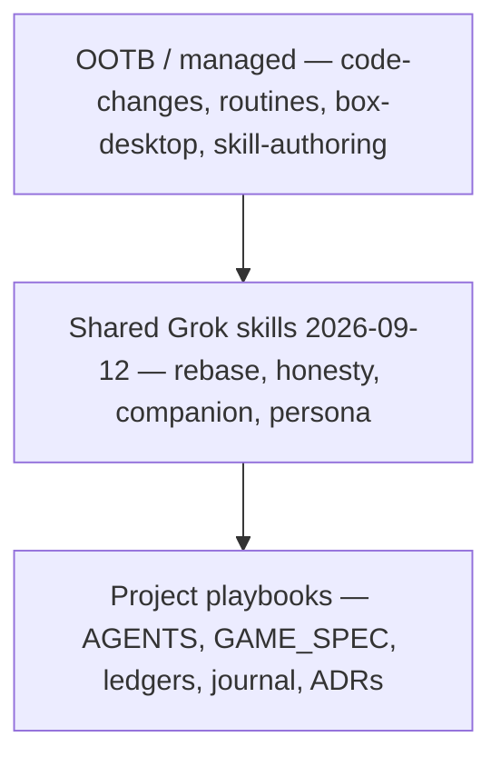
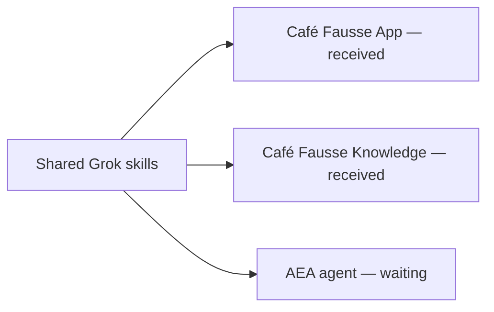

# Skill matrix (2026-09 retrospective)

This page lists which agent skills apply to zorg-dungeon, **who must load them**, and **why they were chosen**. It is not a new game rule and it does not promote any FR/NFR. Formal IDs stay in [[GAME_SPEC]]; proof stays in [[STATUS_LEDGER]].

**Keep Learning and Apply** ([AEA #434](https://gitlab.com/artof-group/adaptive-experience-architecture/-/work_items/434), open [!513](https://gitlab.com/artof-group/adaptive-experience-architecture/-/merge_requests/513)): when the build teaches something, write it into the harness (skill, sensor, guide, matrix row, or ADR) before the next loop — so the next agent inherits it instead of rediscovering the failure. Each skill here is an **apply-artifact** of historical pain, not a one-off note. The **Why selected** column already names that pain; the section below maps each row to what we now load. Complements Honesty and Knowledge First; **not** Antifragility (§3 second-miss → sensor). Status in this repo: **Documented / Planned**. Knowledge Pages for this principle: **Unknown** until AEA probes. Do not treat !513 as merged.

AEA skill-matrix source (merged [!512](https://gitlab.com/artof-group/adaptive-experience-architecture/-/merge_requests/512), closes [#433](https://gitlab.com/artof-group/adaptive-experience-architecture/-/work_items/433)): [`research/random-thoughts/2026-09-12-session-memory-log-aea-grok-skill-matrix.md`](https://gitlab.com/artof-group/adaptive-experience-architecture/-/blob/main/research/random-thoughts/2026-09-12-session-memory-log-aea-grok-skill-matrix.md). This zorg page is the in-repo apply map; that file is the AEA retrospective it composes with.

Tracked with [#50](https://github.com/artofdream/zorg-dungeon/issues/50) (this matrix), [#51](https://github.com/artofdream/zorg-dungeon/issues/51) (kid learn page), [#52](https://github.com/artofdream/zorg-dungeon/issues/52) (corpus quarantine), and [#53](https://github.com/artofdream/zorg-dungeon/issues/53) (name the principle).

The set was chosen **after** shipping phases 0–7, the authored campaign, the Difficulté generator, AFK parallel PRs, and first-timer Maker UX work. The point was to encode what kept failing or repeating: rebase trains, honesty promotions, companion docs, and kid journeys. Practice lagged — shared skills were written after that AFK rebase pain, not continuously (see [[FINDINGS]] CF-010). This page is the apply step.

Three kinds:

- **OOTB / managed** — cloud-agent skills that already exist. Load them for the job they name.
- **Shared Grok skill** — recipes saved to the Grok Bot library on 2026-09-12 after the build retrospective. They are not files in this repo; this page is the in-repo map.
- **Project playbook** — committed files in this tree. Chat is not shared memory ([[AGENTS]], [[0003-multi-agent-collaboration]]).

Kid-rules / persona-journey work (in-flight PR #44: `docs/PLAYER_JOURNEYS.md` → `journeys.html`, issue [#51](https://github.com/artofdream/zorg-dungeon/issues/51)) should **compose** with this matrix. This page does not rewrite that copy.

## Matrix

| Skill | Kind | Responsibility (when to load) | Why selected (2026-09 history) |
|---|---|---|---|
| `code-changes` | OOTB / managed | Any cloud-first edit to this repo: engine, Maker, knowledge, docs, CI. | Used for every phase 0–7 slice, the Difficulté generator, campaign browse, and Maker UX. Default path when the work is a PR, not a live click-through. |
| `routines` | OOTB / managed | AFK babysit of open PRs and CI after the producer steps away. | Parallel cloud PRs ran while the sponsor was away. Listeners catch red `ci` / `governance` without a human in the loop. |
| `box-desktop` | OOTB / managed | Live first-play audit of [zorg.artof.link](https://zorg.artof.link). | The 2026-09-12 first-timer pass produced standing persona issues ([#30](https://github.com/artofdream/zorg-dungeon/issues/30)–[#43](https://github.com/artofdream/zorg-dungeon/issues/43)). A screenshot of the knowledge site is not that audit. |
| `skill-authoring` | OOTB / managed | After a miss repeats, save a reusable recipe instead of another paragraph. | The retrospective itself: rebase trains, honesty promotions, companion docs, and kid journeys kept coming back. This page is the map; the skills are the recipes. |
| `pr-train-rebase` | Shared Grok skill (2026-09-12) | Before stacking or landing parallel cloud PRs that share ledgers or `main`. | [#23](https://github.com/artofdream/zorg-dungeon/pull/23) / [#24](https://github.com/artofdream/zorg-dungeon/pull/24) / [#25](https://github.com/artofdream/zorg-dungeon/pull/25) went CONFLICTING after earlier merges. Rebase onto latest `main`; do not rewrite a peer's ledger rows. |
| `honesty-ledger-gate` | Shared Grok skill (2026-09-12) | Before any status word, FR/NFR claim, or invented deferred rule. | [[AGENTS]] §2 and [[STATUS_LEDGER]]: five words only. Sponsor deferrals S2–S6 stay open — never invent room `C` ([[FR-18]]), Gunner duration, or [[FR-4]] earn/spend. Closing a ticket is not proof. |
| `companion-plain-docs` | Shared Grok skill (2026-09-12) | When writing [[PLAYER_GUIDE]], knowledge pages, or mermaid companions. | Guide + diagrams on [knowledge.zorg.artof.link](https://knowledge.zorg.artof.link). Formal [[GAME_SPEC]] wins if English disagrees. CF-007: the companion still said only Warrior/Elf were encoded after phases 4–7. |
| `persona-journey-validation` | Shared Grok skill (2026-09-12) | Live Maker audits and first-timer UX. | 8-year-old bar; standing personas (kid, grown-up helper, campaign, practice, honesty). Issues from the 2026-09-12 live audit. Compose with in-flight kid-rules work — do not stomp it. |
| [[AGENTS]] | Project playbook | First file every agent reads, every session. | Multi-agent honesty: one codebase, no shared chat memory, producer does not merge (S7). |
| [[GAME_SPEC]] | Project playbook | Before changing a rule or citing an FR/NFR. | Source of truth. IDs are frozen. A companion sentence never overrides it. |
| [[STATUS_LEDGER]] | Project playbook | Before writing a status word; update only your rows. | Honesty gate. A test-backed row needs a test path; this matrix does not promote any row. |
| [[FINDINGS]] | Project playbook | When docs and the system disagree; add a sensor if the same miss happens twice. | Antifragility. CF-004 Pages, CF-006 stale web CD, CF-007 stale guide, CF-008 Mechanic codec. |
| `docs/journal/` | Project playbook | End of a slice: what shipped, what stayed open, what the next agent needs. | Second brain. See [[2026-09-10]], [[2026-09-11]], [[2026-09-12]]. |
| `docs/adr/` | Project playbook | Before changing architecture, deploy, or generator shape. | Why the engine is UI-free ([[0002-typescript-monorepo-2d-to-3d]]), how agents collaborate ([[0003-multi-agent-collaboration]]), and later slices (generator, grounded constraints). |

## Keep Learning and Apply

Each row is what we now load so the 2026-09 pain does not have to be rediscovered. Shared Grok skills are library recipes (not files in this tree); playbooks are committed.

| Skill | Keep Learning and Apply (apply-artifact of) |
|---|---|
| `code-changes` | Every phase PR was a cloud edit. Apply: default to this skill for repo work, not a live-only session. |
| `routines` | AFK parallel PRs went red with no one watching. Apply: babysit CI after the producer steps away. |
| `box-desktop` | First-timer audit [#30](https://github.com/artofdream/zorg-dungeon/issues/30)–[#43](https://github.com/artofdream/zorg-dungeon/issues/43) needed a real browser. Apply: live play, not a knowledge screenshot. |
| `skill-authoring` | Rebase / honesty / companion / kid misses repeated as paragraphs. Apply: save a recipe; this matrix is the map. |
| `pr-train-rebase` | [#23](https://github.com/artofdream/zorg-dungeon/pull/23)/[#24](https://github.com/artofdream/zorg-dungeon/pull/24)/[#25](https://github.com/artofdream/zorg-dungeon/pull/25) CONFLICTING after earlier merges. Apply: rebase onto latest `main`; do not rewrite a peer's ledger rows. |
| `honesty-ledger-gate` | S2–S6 deferrals; invented `C` / Gunner / [[FR-4]] would be a lie. Apply: five status words and evidence-only promotions. |
| `companion-plain-docs` | CF-007: guide still said only Warrior/Elf after phases 4–7. Apply: plain English + diagrams; [[GAME_SPEC]] wins. |
| `persona-journey-validation` | 2026-09-12 ~8yo first-play audit. Apply: personas → issues → fix. Compose with [#51](https://github.com/artofdream/zorg-dungeon/issues/51); do not stomp in-flight journey PRs. |
| [[AGENTS]] | Multi-agent chat amnesia and tool-specific drift. Apply: one file, every session. |
| [[GAME_SPEC]] | Companion prose drifting from rules. Apply: IDs frozen; spec wins. |
| [[STATUS_LEDGER]] | Status words used as marketing. Apply: proof or `Unknown` / `Planned`. |
| [[FINDINGS]] | Same miss twice with only a paragraph. Apply: CF + sensor when `Recurrence` ≥ 2. |
| `docs/journal/` | Next agent cannot see the last chat. Apply: end-of-slice handoff on `main`. |
| `docs/adr/` | Architecture re-litigated every session. Apply: read the decision before changing shape. |

## Planned candidates (not skills yet)

Documented / Planned only — do not treat these as loaded shared skills.

| Candidate | Issue | Why? (pain) | What (when acked) |
|---|---|---|---|
| Kid visual rules / learn page | [#51](https://github.com/artofdream/zorg-dungeon/issues/51) | Live audit P1/P6/P10/P12 — win condition and room letters unexplained. | Companion learn page; [[GAME_SPEC]] wins; link from landing How to play. In progress on the journeys PR — compose, do not duplicate. |
| Corpus quarantine honesty | [#52](https://github.com/artofdream/zorg-dungeon/issues/52) | CF-005 N11/N18 quarantine; S5; green corpus must not silently include broken levels. | Recipe for quarantine paths, CI skip, [[FINDINGS]] link; never promote an NFR on quarantined fixtures. |

## Cross-project fit

The four shared Grok skills came from zorg-dungeon pain. Other projects can reuse them when their history matches. Fit below is from **assessments received** — not a live probe of those sites from this page, and not a [[STATUS_LEDGER]] promotion.

### Café Fausse App (received)

Public app: [cafe.artof.link](https://cafe.artof.link). Companion site is separate ([knowledge.cafe.artof.link](https://knowledge.cafe.artof.link)). This subsection is the **App** assessment only.

| Shared skill | Fit | Why (Café App history) |
|---|---|---|
| `pr-train-rebase` | Yes | SES honesty #201 landed after Stack #199 / #202. Same pattern as zorg's Knowledge + App trains: rebase onto latest `main`; do not rewrite a peer's rows. |
| `honesty-ledger-gate` | Yes | Newsletter SES probe and NFR broadband evidence. Did **not** invent Café FR-19. Same gate: status words need a probe; closing a ticket is not proof. |
| `companion-plain-docs` | Partial | Quantic pack helped. App source of truth is **SRS + `freeze.json`**, not a PLAYER_GUIDE twin. Knowledge owns the companion prose. Formal App rules still win if English disagrees. |
| `persona-journey-validation` | Yes / partial | Diner book, Café FR-9 409, newsletter, Operator recording, ROG mobile. Would have caught lightbox / mobile earlier. Not a full first-timer matrix like zorg's kid bar. |

#### Candidates / other projects (Café App)

These are **Café App** recipes, not zorg-dungeon shared Grok skills. Do not load them here unless you are working that App. Not acked as library skills on this repo.

| Candidate | Why it exists on the App |
|---|---|
| `freeze-first` | Code follows SRS / `freeze.json`. Do not invent fields the freeze does not name. |
| `fail-closed missing-DB` | If the database is missing, fail closed — do not pretend the store is up. |
| `probe-before-status-words` | Same honesty habit as [[STATUS_LEDGER]]: probe, then write the status word. |
| `optional SES after-store fail-soft` | Newsletter SES is optional after the store write; a mail miss must not unwind a good save. |
| `official-image allowlist only` | Only official allowlisted images. No random remote art. |
| `staging keep/tear honesty` | Say whether staging is kept or torn down. Do not leave a zombie env implied. |

### Café Fausse Knowledge (received)

Companion site: [knowledge.cafe.artof.link](https://knowledge.cafe.artof.link). This subsection is the **Knowledge** assessment. It does not speak for the App row above.

| Shared skill | Fit | Why (Café Knowledge history) |
|---|---|---|
| `pr-train-rebase` | Yes | Cascade #108 → #111 → #115 → #116, then #201 after #202. Same rebase-train pain: land in order; do not rewrite a peer's rows. |
| `honesty-ledger-gate` | Yes | Café Knowledge NFR-1 / NFR-2 stayed gated until A36 stopwatches. SES store-only after a probe. Status words need a probe. Do not invent Café FR-19. |
| `companion-plain-docs` | Yes (late) | #191–#199 companion + mobile. An earlier pass would have avoided the late rewrite. Formal App/SRS still wins if English disagrees. |
| `persona-journey-validation` | Partial | J1–J8 plus an NFR matrix existed. Named personas would have caught Gallery / PIP / Operator-as-not-FR-19 earlier. |

#### Candidates / other projects (Café Knowledge)

Not a zorg-dungeon shared Grok skill. Do not load it here unless you are working that Knowledge site.

| Candidate | Why it exists on Café Knowledge |
|---|---|
| Knowledge freeze-first + fail-closed Pages probe | One finding → one issue → one PR. Author does not merge. MRC COMMENT. New Bot squash. HTTPS Pages probe before claiming the site is live. A green deploy job is not a content probe (same honesty as zorg CF-004). |

### AEA agent (waiting)

No assessment in yet. Do not invent a fit row. When it arrives, add a table like the Café ones and keep [AEA #434](https://gitlab.com/artof-group/adaptive-experience-architecture/-/work_items/434) / [!512](https://gitlab.com/artof-group/adaptive-experience-architecture/-/merge_requests/512) / [!513](https://gitlab.com/artof-group/adaptive-experience-architecture/-/merge_requests/513) as the AEA cites.

## How to use this page

1. Load **OOTB** skills for the job (edit / babysit / live audit / save a recipe).
2. Load the **shared Grok** skill that matches the repeating miss (rebase, honesty, companion, persona).
3. Read the **project playbooks** on `main`. If it is not in those files, it did not happen.
4. After the build teaches something, **Keep Learning and Apply** ([#434](https://gitlab.com/artof-group/adaptive-experience-architecture/-/work_items/434) / [!513](https://gitlab.com/artof-group/adaptive-experience-architecture/-/merge_requests/513)): write a skill, guide, matrix row, or ADR into the harness before the next loop. Do not stop at a journal sentence. Recurrence → sensor remains [[AGENTS]] §3 Antifragility.
5. **Cross-project fit:** reuse the four shared skills where another project's history matches. Keep that project's source of truth (Café App: SRS + `freeze.json`; Café Knowledge: companion + freeze-first Pages probe). Fill the AEA agent column when that assessment arrives.

This page is a map. It is not Live & Probed evidence and it does not close [[FR-4]], [[FR-18]], or Gunner duration. Knowledge Pages status for this principle is Unknown until AEA probes.
