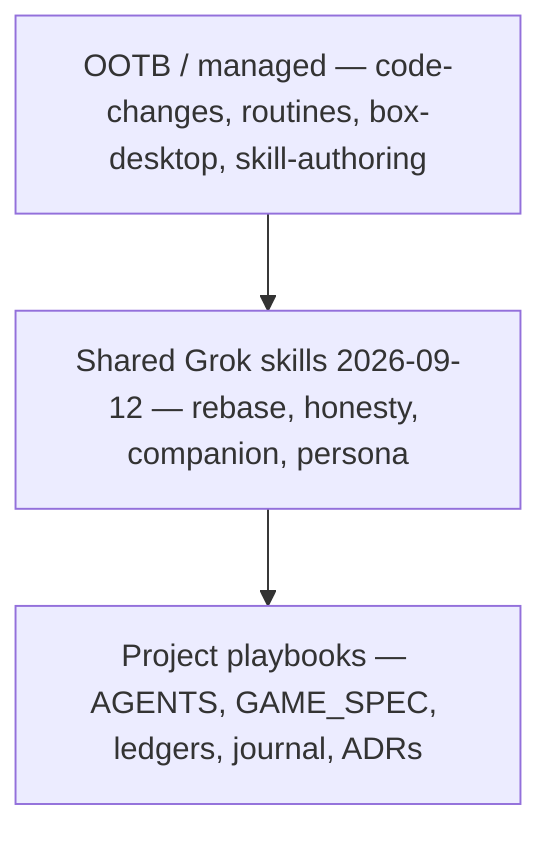

# Skill matrix (2026-09 retrospective)

This page lists which agent skills apply to zorg-dungeon, **who must load them**, and **why they were chosen**. It is not a new game rule and it does not promote any FR/NFR. Formal IDs stay in [[GAME_SPEC]]; proof stays in [[STATUS_LEDGER]].

The set was chosen **after** shipping phases 0–7, the authored campaign, the Difficulté generator, AFK parallel PRs, and first-timer Maker UX work. The point was to encode what kept failing or repeating: rebase trains, honesty promotions, companion docs, and kid journeys.

Three kinds:

- **OOTB / managed** — cloud-agent skills that already exist. Load them for the job they name.
- **Shared Grok skill** — recipes saved to the Grok Bot library on 2026-09-12 after the build retrospective. They are not files in this repo; this page is the in-repo map.
- **Project playbook** — committed files in this tree. Chat is not shared memory ([[AGENTS]], [[0003-multi-agent-collaboration]]).

Kid-rules / persona-journey pages that land later should **compose** with this matrix. Do not rewrite them here.

## Matrix

| Skill | Kind | Responsibility (when to load) | Why selected (2026-09 history) |
|---|---|---|---|
| `code-changes` | OOTB / managed | Any cloud-first edit to this repo: engine, Maker, knowledge, docs, CI. | Used for every phase 0–7 slice, the Difficulté generator, campaign browse, and Maker UX. Default path when the work is a PR, not a live click-through. |
| `routines` | OOTB / managed | AFK babysit of open PRs and CI after the producer steps away. | Parallel cloud PRs ran while the sponsor was away. Listeners catch red `ci` / `governance` without a human in the loop. |
| `box-desktop` | OOTB / managed | Live first-play audit of [zorg.artof.link](https://zorg.artof.link). | The 2026-09-12 first-timer pass produced standing persona issues ([#30](https://github.com/artofdream/zorg-dungeon/issues/30)–[#43](https://github.com/artofdream/zorg-dungeon/issues/43)). A screenshot of the knowledge site is not that audit. |
| `skill-authoring` | OOTB / managed | After a miss repeats, save a reusable recipe instead of another paragraph. | The retrospective itself: rebase trains, honesty promotions, companion docs, and kid journeys kept coming back. This page is the map; the skills are the recipes. |
| `pr-train-rebase` | Shared Grok skill (2026-09-12) | Before stacking or landing parallel cloud PRs that share ledgers or `main`. | [#23](https://github.com/artofdream/zorg-dungeon/pull/23) / [#24](https://github.com/artofdream/zorg-dungeon/pull/24) / [#25](https://github.com/artofdream/zorg-dungeon/pull/25) went CONFLICTING after earlier merges. Rebase onto latest `main`; do not rewrite a peer's ledger rows. |
| `honesty-ledger-gate` | Shared Grok skill (2026-09-12) | Before any status word, FR/NFR claim, or invented deferred rule. | [[AGENTS]] §2 and [[STATUS_LEDGER]]: five words only. Sponsor deferrals S2–S6 stay open — never invent room `C` ([[FR-18]]), Gunner duration, or [[FR-4]] earn/spend. Closing a ticket is not proof. |
| `companion-plain-docs` | Shared Grok skill (2026-09-12) | When writing [[PLAYER_GUIDE]], knowledge pages, or mermaid companions. | Guide + diagrams on [knowledge.zorg.artof.link](https://knowledge.zorg.artof.link). Formal [[GAME_SPEC]] wins if English disagrees. CF-007: the companion still said only Warrior/Elf were encoded after phases 4–7. |
| `persona-journey-validation` | Shared Grok skill (2026-09-12) | Live Maker audits and first-timer UX. | 8-year-old bar; standing personas (kid, grown-up helper, campaign, practice, honesty). Issues from the 2026-09-12 live audit. Compose with in-flight kid-rules work — do not stomp it. |
| [[AGENTS]] | Project playbook | First file every agent reads, every session. | Multi-agent honesty: one codebase, no shared chat memory, producer does not merge (S7). |
| [[GAME_SPEC]] | Project playbook | Before changing a rule or citing an FR/NFR. | Source of truth. IDs are frozen. A companion sentence never overrides it. |
| [[STATUS_LEDGER]] | Project playbook | Before writing a status word; update only your rows. | Honesty gate. `Simulated` needs a test path; this matrix does not promote any row. |
| [[FINDINGS]] | Project playbook | When docs and the system disagree; add a sensor if the same miss happens twice. | Antifragility. CF-004 Pages, CF-006 stale web CD, CF-007 stale guide, CF-008 Mechanic codec. |
| `docs/journal/` | Project playbook | End of a slice: what shipped, what stayed open, what the next agent needs. | Second brain. See [[2026-09-10]], [[2026-09-11]], [[2026-09-12]]. |
| `docs/adr/` | Project playbook | Before changing architecture, deploy, or generator shape. | Why the engine is UI-free ([[0002-typescript-monorepo-2d-to-3d]]), how agents collaborate ([[0003-multi-agent-collaboration]]), and later slices (generator, grounded constraints). |

## How to use this page

1. Load **OOTB** skills for the job (edit / babysit / live audit / save a recipe).
2. Load the **shared Grok** skill that matches the repeating miss (rebase, honesty, companion, persona).
3. Read the **project playbooks** on `main`. If it is not in those files, it did not happen.

This page is a map. It is not Live & Probed evidence and it does not close [[FR-4]], [[FR-18]], or Gunner duration.
