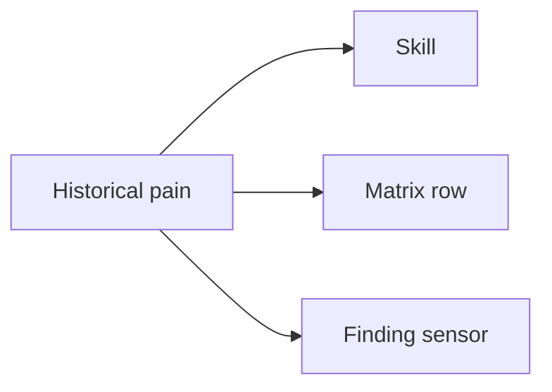
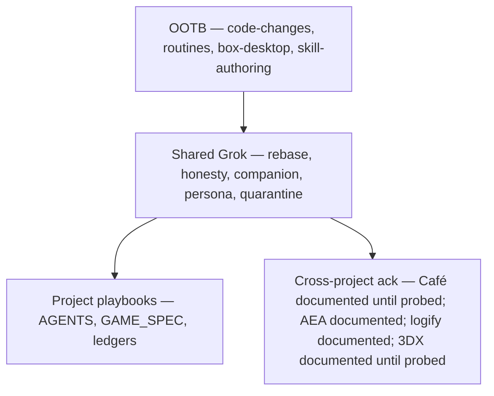

# Skill matrix (2026-09 retrospective)

One table shape everywhere: **Skill | Scope | Why? (historical evidence) | What (recipe / responsibility)**.

This page is a map, not a new game rule and not a [[STATUS_LEDGER]] promotion. Formal game IDs stay in [[GAME_SPEC]].

## Umbrella — Keep Learning and Apply

AEA core principle. Cite [GitLab #434](https://gitlab.com/artof-group/adaptive-experience-architecture/-/work_items/434) (sponsor reports [!513](https://gitlab.com/artof-group/adaptive-experience-architecture/-/merge_requests/513) merged; #434 closed). Official one-liner from the AEA agent (PR #54 / [[AGENTS]]):

> When the build teaches something, write it into the harness (skill, sensor, guide, matrix row, or ADR) before the next loop — so the next agent inherits it instead of rediscovering the failure.

Loop on this page: **historical pain → skill / matrix row / finding sensor**. Complements Honesty and Knowledge First. **Not** Antifragility (second-miss → CI/test gate). A chat note is not apply.

[GitLab #434](https://gitlab.com/artof-group/adaptive-experience-architecture/-/work_items/434) is the **stable formal principle**. Principle: **Documented** on AEA main (sponsor reports !513 merged / #434 closed). GitLab sign-in from this agent is not a merge probe. Knowledge Pages: **Unknown** until AEA probes. Not Live.

### Cross-project adopt links

| Lane | Adopt | Honesty |
|---|---|---|
| AEA | Matrix: merged [!512](https://gitlab.com/artof-group/adaptive-experience-architecture/-/merge_requests/512) (Documented, closes [#433](https://gitlab.com/artof-group/adaptive-experience-architecture/-/work_items/433)). Principle: [!513](https://gitlab.com/artof-group/adaptive-experience-architecture/-/merge_requests/513) / [#434](https://gitlab.com/artof-group/adaptive-experience-architecture/-/work_items/434) | Documented on AEA main (Pages Unknown). GitLab sign-in is not a probe. |
| zorg-dungeon | [#53](https://github.com/artofdream/zorg-dungeon/issues/53) | **Documented; zorg knowledge Pages Probed** (2026-09-13: [skills](https://knowledge.zorg.artof.link/skills.html), [aea](https://knowledge.zorg.artof.link/aea.html), [findings](https://knowledge.zorg.artof.link/findings.html) HTTP 200). AEA Pages **Unknown**. |
| Café Fausse Knowledge | Cites [#434](https://gitlab.com/artof-group/adaptive-experience-architecture/-/work_items/434) on [#213](https://github.com/artofdream/aea-interactive-design/issues/213) / matrix PR (+ [#203](https://github.com/artofdream/aea-interactive-design/issues/203) / [#204](https://github.com/artofdream/aea-interactive-design/issues/204)) | Documented until probed |
| Café Fausse App | Cites [#434](https://gitlab.com/artof-group/adaptive-experience-architecture/-/work_items/434); Grok skill filed [#214](https://github.com/artofdream/aea-interactive-design/issues/214) (`keep-learning-and-apply`); folds into [#205](https://github.com/artofdream/aea-interactive-design/issues/205) | Documented until probed |
| logify | [#24](https://github.com/artofdream/logify/issues/24) closed; [PR #25](https://github.com/artofdream/logify/pull/25) merged on `main`; cites #434 | Documented |
| 3DX Lab | [#10](https://github.com/artofdream/3dx-lab/issues/10) Keep Learning gap; draft [PR #11](https://github.com/artofdream/3dx-lab/pull/11) | Documented until probed (404 from this agent) |
| Café Fausse MRC | **COMMENT-only** | Not a skill creator |
| ctos | **N/A** | Docker smoke is a repo script |

**ctos** is **N/A**. Café App is **folding into** [#205](https://github.com/artofdream/aea-interactive-design/issues/205).



[[AGENTS]] owns the playbook wording (sibling `bc-054efe6b` / PR #54). This page is the apply map. Compose — do not duplicate that section.

AEA skill-matrix source (merged [!512](https://gitlab.com/artof-group/adaptive-experience-architecture/-/merge_requests/512), closes [#433](https://gitlab.com/artof-group/adaptive-experience-architecture/-/work_items/433)): [`research/random-thoughts/2026-09-12-session-memory-log-aea-grok-skill-matrix.md`](https://gitlab.com/artof-group/adaptive-experience-architecture/-/blob/main/research/random-thoughts/2026-09-12-session-memory-log-aea-grok-skill-matrix.md).

Zorg issues (opened):
- [Adopt shared skill matrix #50](https://github.com/artofdream/zorg-dungeon/issues/50)
- [Kid visual rules / learn page #51](https://github.com/artofdream/zorg-dungeon/issues/51)
- [Corpus quarantine honesty #52](https://github.com/artofdream/zorg-dungeon/issues/52)
- [Keep Learning and Apply #53](https://github.com/artofdream/zorg-dungeon/issues/53)
- First-play / journey UX: [#36](https://github.com/artofdream/zorg-dungeon/issues/36)–[#48](https://github.com/artofdream/zorg-dungeon/issues/48) (audit also filed [#30](https://github.com/artofdream/zorg-dungeon/issues/30)–[#35](https://github.com/artofdream/zorg-dungeon/issues/35))

Sand-workflow **URLs** — paste in a follow-up; slugs below are the library names. Do not invent ids.

Kid-rules work (PR #44 / [#51](https://github.com/artofdream/zorg-dungeon/issues/51)) should **compose** with this page. Do not rewrite that copy here.



## Loaded on this repo

| Skill | Scope | Why? (historical evidence) | What (recipe / responsibility) |
|---|---|---|---|
| Keep Learning and Apply | Umbrella · [GitLab #434](https://gitlab.com/artof-group/adaptive-experience-architecture/-/work_items/434) formal (stable) · Documented on AEA main; AEA Pages Unknown · **zorg knowledge Pages Probed** (2026-09-13) | Phases 0–7, AFK trains, first-play audits. Adopt: zorg [#53](https://github.com/artofdream/zorg-dungeon/issues/53), Café App [#214](https://github.com/artofdream/aea-interactive-design/issues/214), Café Knowledge [#213](https://github.com/artofdream/aea-interactive-design/issues/213), logify [#24](https://github.com/artofdream/logify/issues/24) / [PR #25](https://github.com/artofdream/logify/pull/25), 3DX [#10](https://github.com/artofdream/3dx-lab/issues/10). | Historical pain → skill / matrix row / finding sensor. Write it before the next loop. Not Live & Probed for game FRs. |
| `code-changes` | OOTB / managed | Used for every phase 0–7 slice, the Difficulté generator, campaign, and Maker UX. | Load for any cloud-first edit to this tree (engine, Maker, knowledge, docs, CI). |
| `routines` | OOTB / managed | AFK parallel PRs went red with no one watching. | Babysit open PRs / CI after the producer steps away. |
| `box-desktop` | OOTB / managed | 2026-09-12 first-play audit produced [#30](https://github.com/artofdream/zorg-dungeon/issues/30)–[#48](https://github.com/artofdream/zorg-dungeon/issues/48). | Live audit of [zorg.artof.link](https://zorg.artof.link). A knowledge screenshot is not that audit. |
| `skill-authoring` | OOTB / managed | Rebase / honesty / companion / kid misses kept coming back as paragraphs. | After a miss repeats, save a recipe. This page is the map. |
| `pr-train-rebase` | Shared Grok skill · sand-workflow `pr-train-rebase` | [#23](https://github.com/artofdream/zorg-dungeon/pull/23) / [#24](https://github.com/artofdream/zorg-dungeon/pull/24) / [#25](https://github.com/artofdream/zorg-dungeon/pull/25) CONFLICTING after earlier merges. | Before stacking parallel cloud PRs: rebase onto latest `main`; do not rewrite a peer's ledger rows. Adoption: [#50](https://github.com/artofdream/zorg-dungeon/issues/50). |
| `honesty-ledger-gate` | Shared Grok skill · sand-workflow `honesty-ledger-gate` | S2–S6 deferrals. Invented `C` / Gunner duration / [[FR-4]] would be a lie. | Before any status word: five-word vocabulary; evidence or `Unknown`. Never invent those deferred rules. Adoption: [#50](https://github.com/artofdream/zorg-dungeon/issues/50). |
| `companion-plain-docs` | Shared Grok skill · sand-workflow `companion-plain-docs` | CF-007: [[PLAYER_GUIDE]] still said only Warrior/Elf after phases 4–7. | Plain English + mermaid on [knowledge.zorg.artof.link](https://knowledge.zorg.artof.link). [[GAME_SPEC]] wins. Adoption: [#50](https://github.com/artofdream/zorg-dungeon/issues/50). |
| `persona-journey-validation` | Shared Grok skill · sand-workflow `persona-journey-validation` | ~8yo first-play audit; standing personas; UX issues [#36](https://github.com/artofdream/zorg-dungeon/issues/36)–[#48](https://github.com/artofdream/zorg-dungeon/issues/48) (also [#30](https://github.com/artofdream/zorg-dungeon/issues/30)–[#35](https://github.com/artofdream/zorg-dungeon/issues/35)). | Live Maker audit → named personas → issues → fix. Compose with [#51](https://github.com/artofdream/zorg-dungeon/issues/51). Adoption: [#50](https://github.com/artofdream/zorg-dungeon/issues/50). |
| `corpus-quarantine-honesty` | Shared Grok skill · sand-workflow `corpus-quarantine-honesty` · **created** (zorg-evidenced) | CF-005 N11 / N18; S5; green corpus must not silently include broken levels. Tracked: [#52](https://github.com/artofdream/zorg-dungeon/issues/52). | Quarantine paths, CI skip, [[FINDINGS]] link. Never promote an NFR on quarantined fixtures. Adoption: [#50](https://github.com/artofdream/zorg-dungeon/issues/50). |
| [[AGENTS]] | Project playbook | Multi-agent chat amnesia and tool-specific drift. | First file every session. Producer does not merge (S7). |
| [[GAME_SPEC]] | Project playbook | Companion prose drifting from rules. | Source of truth. IDs frozen. A companion sentence never overrides it. |
| [[STATUS_LEDGER]] | Project playbook | Status words used as marketing. | Proof or `Unknown` / `Planned`. Update only your rows. |
| [[FINDINGS]] | Project playbook | Same miss twice with only a paragraph. | CF + sensor when `Recurrence` ≥ 2. |
| `docs/journal/` | Project playbook | Next agent cannot see the last chat. | End-of-slice handoff on `main`. |
| `docs/adr/` | Project playbook | Architecture re-litigated every session. | Read the decision before changing shape. |

## Cross-project fit

Fit verdicts below are **assessments** unless a linked issue / work item says otherwise. Other-lane skills are **Documented / Simulated**, not Live & Probed, and **not** a [[STATUS_LEDGER]] promotion. Do not invent sand-workflow ids.

| Project | Ack | Note |
|---|---|---|
| ctos | **N/A** | No skill gap. Docker smoke is a repo script, not a shared Grok skill. |
| Café Fausse MRC | **COMMENT-only** | Skills belong on the Café train. MRC COMMENT. No self-merge on one-issue PRs. **New Bot** squash-merges Café skill PRs when MRC is **CLEAN**. |
| Café Fausse App | **Documented until probed** | Cites [GitLab #434](https://gitlab.com/artof-group/adaptive-experience-architecture/-/work_items/434). Grok skill [#214](https://github.com/artofdream/aea-interactive-design/issues/214) (`keep-learning-and-apply`). Folds into [#205](https://github.com/artofdream/aea-interactive-design/issues/205) / [PR #215](https://github.com/artofdream/aea-interactive-design/pull/215). Shared four via [#206](https://github.com/artofdream/aea-interactive-design/issues/206). Created [#207](https://github.com/artofdream/aea-interactive-design/issues/207)–[#212](https://github.com/artofdream/aea-interactive-design/issues/212). Not Live. |
| Café Fausse Knowledge | **Documented until probed** | Cites [#434](https://gitlab.com/artof-group/adaptive-experience-architecture/-/work_items/434) on [#213](https://github.com/artofdream/aea-interactive-design/issues/213) / matrix PR (+ [#203](https://github.com/artofdream/aea-interactive-design/issues/203) / [#204](https://github.com/artofdream/aea-interactive-design/issues/204)). Not Live. |
| AEA agent | **Documented** on AEA main | Formal principle [GitLab #434](https://gitlab.com/artof-group/adaptive-experience-architecture/-/work_items/434) (sponsor reports [!513](https://gitlab.com/artof-group/adaptive-experience-architecture/-/merge_requests/513) merged / #434 closed). Matrix vault [!512](https://gitlab.com/artof-group/adaptive-experience-architecture/-/merge_requests/512) / [AEA #433](https://gitlab.com/artof-group/adaptive-experience-architecture/-/work_items/433). Pages **Unknown**. Shared four referenced (no dup). Not Live. |
| logify | **Documented** on `main` | Keep Learning [#24](https://github.com/artofdream/logify/issues/24) closed; [PR #25](https://github.com/artofdream/logify/pull/25) merged; cites AEA #434. Skills created: `pr-train-parallel-merge` [#22](https://github.com/artofdream/logify/issues/22), `tagged-release-cut` [#23](https://github.com/artofdream/logify/issues/23) stay Documented / Simulated. Companion / personas **N/A**. Not Live. |
| 3DX Lab | **Documented until probed** | Issues [#7](https://github.com/artofdream/3dx-lab/issues/7) honesty, [#8](https://github.com/artofdream/3dx-lab/issues/8) infra-apply, [#9](https://github.com/artofdream/3dx-lab/issues/9) lab-vs-factory, [#10](https://github.com/artofdream/3dx-lab/issues/10) Keep Learning. Skills created: `3dx-lab-honesty`, `3dx-lab-infra-apply`, `3dx-lab-lab-vs-factory`. Draft [PR #11](https://github.com/artofdream/3dx-lab/pull/11) awaiting sponsor merge. This agent got 404 — not a probe. Shared PR-train / companion / personas **N/A**. Not Live. |

### ctos (N/A)

No shared-skill gap. Docker smoke stays a ctos repo script. Do not add a skill row for it.

### Café Fausse App (Documented until probed)

App: [cafe.artof.link](https://cafe.artof.link). Knowledge is a separate site. Repo: [artofdream/aea-interactive-design](https://github.com/artofdream/aea-interactive-design). Cites [GitLab #434](https://gitlab.com/artof-group/adaptive-experience-architecture/-/work_items/434). Grok skill filed [#214](https://github.com/artofdream/aea-interactive-design/issues/214) (`keep-learning-and-apply`). **Folding into** [#205](https://github.com/artofdream/aea-interactive-design/issues/205): [`knowledge/skills-matrix.md`](https://github.com/artofdream/aea-interactive-design/blob/main/knowledge/skills-matrix.md) → [`skills-matrix.html`](https://knowledge.cafe.artof.link/skills-matrix.html) ([PR #215](https://github.com/artofdream/aea-interactive-design/pull/215), run `bc-b919b061`). A merged matrix PR is not a Pages probe. Honesty: **Documented until probed**. **New Bot** squash-merges skill PRs when MRC is **CLEAN**.

Shared four — adopt by link via [#206](https://github.com/artofdream/aea-interactive-design/issues/206), no dup.

| Skill | Scope | Why? (historical evidence) | What (recipe / responsibility) |
|---|---|---|---|
| `pr-train-rebase` | Shared · adopt [#206](https://github.com/artofdream/aea-interactive-design/issues/206) | SES honesty #201 after Stack #199 / #202. | Rebase onto latest `main`. Do not rewrite a peer's rows. |
| `honesty-ledger-gate` | Shared · adopt [#206](https://github.com/artofdream/aea-interactive-design/issues/206) | Newsletter SES probe; no invented Café FR-19. | Status words need a probe. |
| `companion-plain-docs` | Shared · adopt [#206](https://github.com/artofdream/aea-interactive-design/issues/206) · Partial | App SoT is **SRS + `freeze.json`**. Knowledge owns companion. | Do not treat App copy as a PLAYER_GUIDE twin. |
| `persona-journey-validation` | Shared · adopt [#206](https://github.com/artofdream/aea-interactive-design/issues/206) · Partial | Diner book, Café FR-9 409, ROG mobile. | Personas → journeys → issues. Not a full ~8yo matrix. |
| `keep-learning-and-apply` | Created / Café App · [#214](https://github.com/artofdream/aea-interactive-design/issues/214) · Documented until probed | Cites [GitLab #434](https://gitlab.com/artof-group/adaptive-experience-architecture/-/work_items/434). Folds into [#205](https://github.com/artofdream/aea-interactive-design/issues/205). | Gap → issue → create/adopt skill → apply on next cut. Not Live. |
| `freeze-first-generation` | Created / Café App · [#207](https://github.com/artofdream/aea-interactive-design/issues/207) | Freeze-first MVP + CI freeze sensor. | Code follows SRS + `freeze.json`. No invented IDs. Documented / Simulated, not Live. |
| `fail-closed-missing-db` | Created / Café App · [#208](https://github.com/artofdream/aea-interactive-design/issues/208) | Missing store must not look up. | Fail closed if Postgres is missing. Documented / Simulated, not Live. |
| `probe-before-status-words` | Created / Café App · [#209](https://github.com/artofdream/aea-interactive-design/issues/209) | SES skipped; NFR timings. | This-session probe or Unknown. Documented / Simulated, not Live. |
| `optional-mail-after-store` | Created / Café App · [#210](https://github.com/artofdream/aea-interactive-design/issues/210) | #135 / #138 SES; store-only honesty. | Store first; fail soft if mail misses. Not a new FR. Documented / Simulated, not Live. |
| `official-image-allowlist` | Created / Café App · [#211](https://github.com/artofdream/aea-interactive-design/issues/211) | Official four webps vs extras. | Official allowlist only. Documented / Simulated, not Live. |
| `staging-keep-tear-honesty` | Created / Café App · [#212](https://github.com/artofdream/aea-interactive-design/issues/212) | Keep-until-scoring / #190. | Lock keep/tear the day decided. Documented / Simulated, not Live. |

### Café Fausse Knowledge (Documented until probed)

Companion: [knowledge.cafe.artof.link](https://knowledge.cafe.artof.link). Does not speak for the App row. Cites [GitLab #434](https://gitlab.com/artof-group/adaptive-experience-architecture/-/work_items/434) on [#213](https://github.com/artofdream/aea-interactive-design/issues/213) / the Honesty matrix PR ([#203](https://github.com/artofdream/aea-interactive-design/issues/203) / [PR #216](https://github.com/artofdream/aea-interactive-design/pull/216)). Pages ratchet: [#204](https://github.com/artofdream/aea-interactive-design/issues/204). Shared four stay adopt-by-reference (same as [#206](https://github.com/artofdream/aea-interactive-design/issues/206)). Honesty: **Documented until probed**.

| Skill | Scope | Why? (historical evidence) | What (recipe / responsibility) |
|---|---|---|---|
| `pr-train-rebase` | Shared · adopt (no dup) | Cascade #108 → #111 → #115 → #116, then #201 after #202. | Land in order. Do not rewrite a peer's rows. |
| `honesty-ledger-gate` | Shared · adopt (no dup) | Café Knowledge NFR-1 / NFR-2 gated until A36 stopwatches. | Status words need a probe. Do not invent Café FR-19. |
| `companion-plain-docs` | Shared · adopt (no dup) | #191–#199 companion + mobile. | Companion + diagrams; formal App/SRS wins if English disagrees. |
| `persona-journey-validation` | Shared · adopt (no dup) · Partial | J1–J8 + NFR matrix existed. | Named personas would have caught Gallery / PIP earlier. |
| Keep Learning and Apply | Adopt · [#213](https://github.com/artofdream/aea-interactive-design/issues/213) / matrix PR · Documented until probed | Cites [GitLab #434](https://gitlab.com/artof-group/adaptive-experience-architecture/-/work_items/434) on #213 and the Honesty matrix PR ([#203](https://github.com/artofdream/aea-interactive-design/issues/203) / [PR #216](https://github.com/artofdream/aea-interactive-design/pull/216)). | Learn from CF history → skill/matrix update → next PR. Not Live. |
| `knowledge-pages-ratchet` | Created / Café Knowledge · [#204](https://github.com/artofdream/aea-interactive-design/issues/204) | Green deploy is not a content probe (same class as zorg CF-004). Matrix row via [#203](https://github.com/artofdream/aea-interactive-design/issues/203). | One finding → one PR → MRC COMMENT-only → New Bot squash when CLEAN → HTTPS Pages probe before claiming live. Documented / Planned, not Live. |

### AEA agent (Documented on AEA main; Pages Unknown)

Work item: [AEA #433](https://gitlab.com/artof-group/adaptive-experience-architecture/-/work_items/433) (merged [!512](https://gitlab.com/artof-group/adaptive-experience-architecture/-/merge_requests/512)). Keep Learning is the stable formal principle [AEA #434](https://gitlab.com/artof-group/adaptive-experience-architecture/-/work_items/434) (sponsor reports [!513](https://gitlab.com/artof-group/adaptive-experience-architecture/-/merge_requests/513) merged and #434 closed). Principle: **Documented** on AEA main. Knowledge Pages: **Unknown** until AEA probes. GitLab sign-in from this agent is not a merge probe. Café-specific recipes stay on the Café rows (deferred here). Other-lane skills **Documented until probed**.

Shared four — **referenced, not duplicated** as AEA-created skills: `pr-train-rebase`, `honesty-ledger-gate`, `companion-plain-docs`, `persona-journey-validation`.

| Skill | Scope | Why? (historical evidence) | What (recipe / responsibility) |
|---|---|---|---|
| Shared four (referenced, no dup) | Reference only · Documented | Same four already loaded on zorg-dungeon. #433 points at them. | Reuse the shared slugs. Do not create a second AEA copy. |
| `one-finding-one-mr` | Created / AEA · Documented | Named on the #433 vault. | One finding → one MR. Not Live. |
| `coordinator-merge-hats` | Created / AEA · Documented | Named on the #433 vault. | Coordinator hat and merge hat stay distinct. Not Live. |
| `deploy-schema-honesty` | Created / AEA · Documented | Named on the #433 vault. | Do not claim deploy / schema live without a probe. Not Live. |
| `committed-vault-memory` | Created / AEA · Documented | Named on the #433 vault. | Vault memory is the committed file, not chat. Not Live. |
| `process-coherence-mr-body` | Created / AEA · Documented | Named on the #433 vault. | MR body stays coherent with the process. Not Live. |

### logify (Documented on main; not Live)

Repo: [artofdream/logify](https://github.com/artofdream/logify). Keep Learning **Documented** on logify `main`: [#24](https://github.com/artofdream/logify/issues/24) closed; [PR #25](https://github.com/artofdream/logify/pull/25) merged; cites AEA [GitLab #434](https://gitlab.com/artof-group/adaptive-experience-architecture/-/work_items/434). Skills **created** after agree: [#22](https://github.com/artofdream/logify/issues/22) / [#23](https://github.com/artofdream/logify/issues/23) stay Documented / Simulated. Companion / personas **N/A**. Not Live.

| Skill | Scope | Why? (historical evidence) | What (recipe / responsibility) |
|---|---|---|---|
| `pr-train-parallel-merge` | Created · [#22](https://github.com/artofdream/logify/issues/22) · Documented / Simulated | AFK tracks #17–#19 CONFLICTING; ADR-0010 collisions, ledger / README churn. | Merge order, pre-assign free ADR numbers, rebase remaining PRs. Do not mark NFR Implemented from an agent summary. Not Live. |
| `tagged-release-cut` | Created · [#23](https://github.com/artofdream/logify/issues/23) · Documented / Simulated | v0.1.0 last-mile ldflags + annotated tag. That release predates the skill. | Annotated `vX.Y.Z`, wait for `release.yml` assets. Leave Partial NFRs Partial. Not Live. |
| `companion-plain-docs` | Fit: **N/A** | Out of scope on [#23](https://github.com/artofdream/logify/issues/23). | Do not load this skill for logify work. |
| `persona-journey-validation` | Fit: **N/A** | Out of scope on [#23](https://github.com/artofdream/logify/issues/23). | Do not load this skill for logify work. |

### 3DX Lab (Documented until probed)

Shared `pr-train-rebase`, `companion-plain-docs`, and `persona-journey-validation` are **N/A** for 3DX. Sponsor-reported issues and created skills below. Draft [PR #11](https://github.com/artofdream/3dx-lab/pull/11) awaits sponsor merge. This agent got **404** on `artofdream/3dx-lab` — URLs are not independently probed here. Not Live & Probed.

| Skill | Scope | Why? (historical evidence) | What (recipe / responsibility) |
|---|---|---|---|
| `pr-train-rebase` | Fit: **N/A** | 3DX is not running a zorg-style PR train. | Do not load this skill for 3DX work. |
| `companion-plain-docs` | Fit: **N/A** | No PLAYER_GUIDE twin on the lab. | Do not load this skill for 3DX work. |
| `persona-journey-validation` | Fit: **N/A** | No first-timer persona matrix on the lab. | Do not load this skill for 3DX work. |
| `3dx-lab-honesty` | Created / 3DX · [#7](https://github.com/artofdream/3dx-lab/issues/7) · Documented until probed | Sponsor-filed after broadcast clarification. | Honesty gate for lab claims. Not Live. |
| `3dx-lab-infra-apply` | Created / 3DX · [#8](https://github.com/artofdream/3dx-lab/issues/8) · Documented until probed | Sponsor-laptop Terraform apply is lab-specific. | Apply infra from the sponsor laptop only as that recipe says. Not Live. |
| `3dx-lab-lab-vs-factory` | Created / 3DX · [#9](https://github.com/artofdream/3dx-lab/issues/9) · Documented until probed | Lab must not be treated as the factory path. | Keep lab and factory scopes distinct. Not Live. |
| Keep Learning and Apply | Adopt · [#10](https://github.com/artofdream/3dx-lab/issues/10) · Documented until probed | Gap filed; cites AEA #434 on the 3DX train. | Write the lesson into the harness before the next loop. Draft PR #11. Not Live. |

## Proposed / other-repo (not Live)

Other-lane skills below are **Documented / Simulated** until probed — not loaded on zorg-dungeon, not Live & Probed. Café App / Knowledge rows now have issue URLs.

| Skill | Scope | Why? (historical evidence) | What (recipe / responsibility) |
|---|---|---|---|
| `keep-learning-and-apply` | Documented until probed · Café App · [#214](https://github.com/artofdream/aea-interactive-design/issues/214) | Cites AEA #434; folds into #205. | Other-lane. Not Live. |
| `freeze-first-generation` | Documented / Simulated · Café App · [#207](https://github.com/artofdream/aea-interactive-design/issues/207) | Created 2026-09-12. | Other-lane. Not Live. |
| `fail-closed-missing-db` | Documented / Simulated · Café App · [#208](https://github.com/artofdream/aea-interactive-design/issues/208) | Created 2026-09-12. | Other-lane. Not Live. |
| `probe-before-status-words` | Documented / Simulated · Café App · [#209](https://github.com/artofdream/aea-interactive-design/issues/209) | Created 2026-09-12. | Other-lane. Not Live. |
| `optional-mail-after-store` | Documented / Simulated · Café App · [#210](https://github.com/artofdream/aea-interactive-design/issues/210) | Created 2026-09-12. | Other-lane. Not Live. |
| `official-image-allowlist` | Documented / Simulated · Café App · [#211](https://github.com/artofdream/aea-interactive-design/issues/211) | Created 2026-09-12. | Other-lane. Not Live. |
| `staging-keep-tear-honesty` | Documented / Simulated · Café App · [#212](https://github.com/artofdream/aea-interactive-design/issues/212) | Created 2026-09-12. | Other-lane. Not Live. |
| `knowledge-pages-ratchet` | Documented / Simulated · Café Knowledge · [#204](https://github.com/artofdream/aea-interactive-design/issues/204) | Matrix via [#203](https://github.com/artofdream/aea-interactive-design/issues/203). | Other-lane. Not Live. |
| `3dx-lab-honesty` | Documented until probed · 3DX Lab · [#7](https://github.com/artofdream/3dx-lab/issues/7) | Created on the 3DX train. | Other-lane. Not Live. |
| `3dx-lab-infra-apply` | Documented until probed · 3DX Lab · [#8](https://github.com/artofdream/3dx-lab/issues/8) | Created on the 3DX train. | Other-lane. Not Live. |
| `3dx-lab-lab-vs-factory` | Documented until probed · 3DX Lab · [#9](https://github.com/artofdream/3dx-lab/issues/9) | Created on the 3DX train. | Other-lane. Not Live. |
| `one-finding-one-mr` | Documented / AEA · [#433](https://gitlab.com/artof-group/adaptive-experience-architecture/-/work_items/433) | Created on the AEA vault. | Other-lane. Documented until probed. Not Live. |
| `coordinator-merge-hats` | Documented / AEA · [#433](https://gitlab.com/artof-group/adaptive-experience-architecture/-/work_items/433) | Created on the AEA vault. | Other-lane. Documented until probed. Not Live. |
| `deploy-schema-honesty` | Documented / AEA · [#433](https://gitlab.com/artof-group/adaptive-experience-architecture/-/work_items/433) | Created on the AEA vault. | Other-lane. Documented until probed. Not Live. |
| `committed-vault-memory` | Documented / AEA · [#433](https://gitlab.com/artof-group/adaptive-experience-architecture/-/work_items/433) | Created on the AEA vault. | Other-lane. Documented until probed. Not Live. |
| `process-coherence-mr-body` | Documented / AEA · [#433](https://gitlab.com/artof-group/adaptive-experience-architecture/-/work_items/433) | Created on the AEA vault. | Other-lane. Documented until probed. Not Live. |
| `pr-train-parallel-merge` | Documented / logify · [#22](https://github.com/artofdream/logify/issues/22) | Created after agree clarification. | Other-lane. Documented until probed. Not Live. |
| `tagged-release-cut` | Documented / logify · [#23](https://github.com/artofdream/logify/issues/23) | Created after agree clarification. | Other-lane. Documented until probed. Not Live. |

## Planned (zorg-dungeon)

Not loaded shared skills. **Planned** until the recipe is written. `corpus-quarantine-honesty` moved to **created** above ([#52](https://github.com/artofdream/zorg-dungeon/issues/52)). Spec-phased slice has no GitHub issue yet (`issues: write` 403 — paste the body below).

| Skill | Scope | Why? (historical evidence) | What (recipe / responsibility) |
|---|---|---|---|
| Kid visual rules / learn page | Planned · [#51](https://github.com/artofdream/zorg-dungeon/issues/51) | Live audit P1 / P6 / P10 / P12 — win condition and room letters unexplained. | Companion learn page; [[GAME_SPEC]] wins; link from landing How to play. Compose with PR #44. |
| Spec-phased engine slice | Planned · issue not filed (403) | Phases 0–7 were one-phase PRs. A slice that invented `C` / Gunner duration / [[FR-4]] would break [[NFR-8]]. | One [[GAME_SPEC]] phase per PR. Only that phase's FR/NFR. Update only your ledger rows. Producer does not merge. |

### Paste-ready issue (spec-phased engine slice)

```
## Skill | Scope | Why? | What
- Skill: Spec-phased engine slice
- Scope: packages/engine + ledger rows for one GAME_SPEC phase
- Why? Phases 0–7 shipped as one-phase PRs. Inventing C / Gunner duration / FR-4 breaks NFR-8 / S2–S6.
- What: One phase per PR. Encode only that phase's FR/NFR. Evidence = tests that cite the IDs. Producer does not merge (S7).
Status: Planned. Document in docs/SKILL_MATRIX.md.
```

## How to use this page

1. Load **OOTB** for the job (edit / babysit / live audit / save a recipe).
2. Load the **shared Grok** sand-workflow that matches the repeating miss.
3. Read **project playbooks** on `main`. If it is not there, it did not happen.
4. **Keep Learning and Apply** ([GitLab #434](https://gitlab.com/artof-group/adaptive-experience-architecture/-/work_items/434) formal, stable): when the build teaches something, write it into the harness before the next loop. Umbrella: historical pain → skill / matrix row / finding sensor. Honesty: **Documented; zorg knowledge Pages Probed** (2026-09-13). AEA Pages **Unknown**. Not Live & Probed for game FRs.
5. **Cross-project adopt:** AEA matrix [!512](https://gitlab.com/artof-group/adaptive-experience-architecture/-/merge_requests/512) (merged, Documented) and principle [!513](https://gitlab.com/artof-group/adaptive-experience-architecture/-/merge_requests/513) / [#434](https://gitlab.com/artof-group/adaptive-experience-architecture/-/work_items/434) (Documented on AEA main; Pages Unknown). Café App cites #434 and filed [#214](https://github.com/artofdream/aea-interactive-design/issues/214) (`keep-learning-and-apply`); folds into [#205](https://github.com/artofdream/aea-interactive-design/issues/205). Café Knowledge cites #434 on [#213](https://github.com/artofdream/aea-interactive-design/issues/213) / matrix PR. logify [#24](https://github.com/artofdream/logify/issues/24) / [PR #25](https://github.com/artofdream/logify/pull/25) **Documented** on `main`. 3DX [#10](https://github.com/artofdream/3dx-lab/issues/10) / draft [PR #11](https://github.com/artofdream/3dx-lab/pull/11) **Documented until probed**. Also zorg [#53](https://github.com/artofdream/zorg-dungeon/issues/53) — **Documented; zorg knowledge Pages Probed** (2026-09-13). Café MRC is **COMMENT-only**. ctos is N/A. Not Live & Probed for game FRs.

This page does not close [[FR-4]], [[FR-18]], or Gunner duration.
