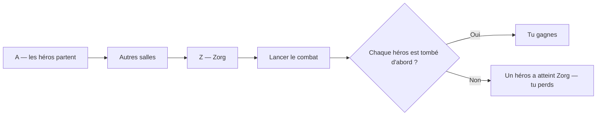
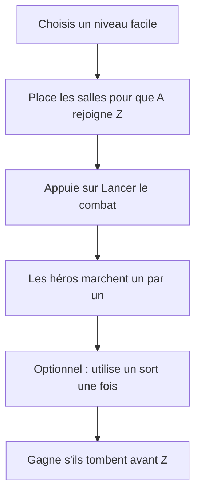
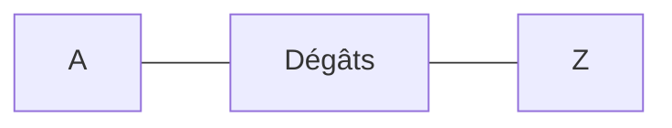
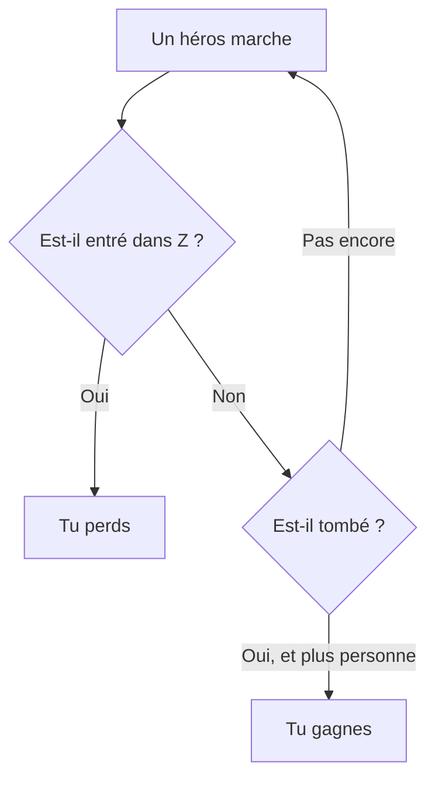

# Apprendre les règles

Tu construis un donjon pour **Zorg**.

Des héros essayent d'aller jusqu'à la salle de Zorg.

Tu gagnes s'ils **tombent avant d'y arriver**.

Jouer ici : [zorg.artof.link](https://zorg.artof.link/?lang=fr)

## Deux métiers

**Métier 1 — Placer les salles.**
Le niveau te donne des tuiles. Tu poses chaque tuile sur le plateau.

**Métier 2 — Lancer le combat.**
Les héros marchent tout seuls. Tu regardes. Tu peux utiliser un sort si tu en as un.

## Comment les salles se collent

- Les salles doivent partager un **côté entier**. Les coins ne comptent pas.
- N'empile pas les salles les unes sur les autres.
- Un bon premier essai : mets **A**, puis les autres salles, puis **Z** en ligne.

Quand les salles forment un donjon relié, **Lancer le combat** s'allume.

## Lettres des salles

Ces lettres sont sur les tuiles. Ce sont les salles que le jeu connaît déjà.

| Lettre | Nom | Ce qui se passe |
|---|---|---|
| A | Départ | Les héros apparaissent ici. |
| Z | Zorg | Un héros qui entre termine la partie. Tu perds. |
| D | Dégâts | Blesse un héros qui entre. Un nombre négatif soigne. |
| E | Élément | Feu, eau, glace ou poison sur des cases spéciales. |
| P | Portail | Peut téléporter un héros vers une salle déjà visitée. |
| O | Or | Le premier héros prend les pièces. |
| T | Péage | Certaines cases coûtent de l'or pour passer. |

Le feu blesse un peu. L'eau est une flaque où tu ne peux pas rester. La glace fait glisser. Le poison aide une fois, puis blesse beaucoup.

## Les héros marchent tout seuls

Tu ne **bouges pas** les héros.

Ils jouent à tour de rôle. Le premier héros avance jusqu'à ce qu'il tombe ou soit bloqué. Puis le suivant.

Ils suivent toujours leur propre plan. Pas de dés.

- **Guerrier** — prend le chemin le plus court vers Zorg.
- **Elfe** — cherche un chemin plus sûr et ignore certains éléments.
- **Mécanicien** — peut pousser une salle dans un espace vide.
- **Canonnier** — peut tirer un Obus en ligne droite.
- **Princesse** — aime les salles « importantes » et peut tirer les autres de ce côté.

Un **Obus** vole jusqu'à un mur ou le bord. Il peut nettoyer des cases dangereuses. Il peut aussi toucher des héros.

## Sorts (optionnel)

Certains niveaux te donnent des sorts. Chaque sort marche **une seule fois**.

Utilise un sort **entre** les pas des héros — pas au milieu d'un pas.

- **Attaque** — blesse les héros.
- **Téléport** — renvoie un héros vers une ancienne salle (ou la salle d'attente).
- **Déplacer** — fait glisser la salle où se trouve un héros.
- **Échanger** — échange deux salles.
- **Sommeil / Réveil** — un héros pause, ou se réveille.
- **Banalité** — ce héros se met à agir comme un Guerrier.
- **Sélection** — utilise un autre sort sur plus d'un héros.

Tu peux gagner beaucoup de niveaux faciles **sans aucun sort**. Place juste un chemin méchant de A à Z.

## Comment tu gagnes

- **Victoire :** chaque héros tombe, et personne n'est entré dans la salle de Zorg.
- **Défaite :** n'importe quel héros entre dans Z.

Réessaie si tu perds. Change le chemin. Mets plus de dégâts sur la route.

## Prêt ?

1. Ouvre [zorg.artof.link](https://zorg.artof.link/?lang=fr).
2. Appuie sur **Commencer ici — Difficulté 1**.
3. Place les salles pour que A pointe vers Z.
4. Appuie sur **Lancer le combat**.

Tu veux un guide plus long pour les grands ? Voir le [[PLAYER_GUIDE|guide du joueur]].

## Notes pour les grands

Tu peux sauter ça. C'est pour les aides et les constructeurs.

Cette page est un **compagnon**. Si une phrase ou une image n'est pas d'accord avec [[GAME_SPEC]], **la spécification gagne**.

Elle décrit seulement les règles que le moteur joue déjà : salles A / Z / D / E / P / O / T, les types de héros ci-dessus, et les sorts à usage unique ci-dessus.

Elle **n'invente pas** une lettre de salle en plus, un timing de tir Gunner en plus, ni des contrats verrouillés.

Pointeurs formels (pas besoin pour jouer) : placer les salles [[FR-5]] [[FR-6]] [[FR-7]] [[FR-8]] ; apparition / Zorg / dégâts / éléments / portails / or / péages [[FR-11]] [[FR-12]] [[FR-13]] [[FR-14]] [[FR-15]] [[FR-16]] [[FR-17]] ; héros [[FR-19]] [[FR-20]] [[FR-21]] [[FR-22]] [[FR-23]] [[FR-24]] [[FR-25]] [[FR-26]] ; sorts [[FR-32]] [[FR-33]] [[FR-34]] [[FR-35]] [[FR-36]] [[FR-37]] [[FR-39]] [[FR-40]] [[FR-41]] [[FR-42]] ; idée gagner / perdre [[FR-12]] [[FR-43]]. La lecture Maker montre encore le résultat du combat à l'écran.

Plus de listes : [[PLAYER_JOURNEYS|parcours personas]].
