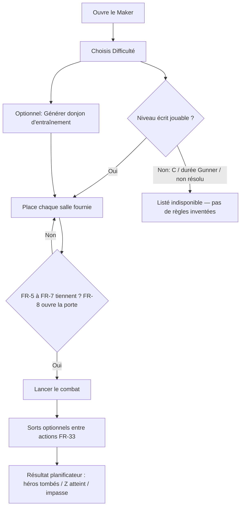
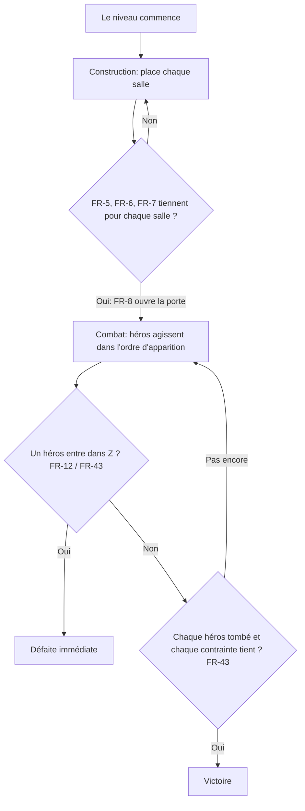

# Guide du joueur et du constructeur

Cette page est un **compagnon en français** de [[GAME_SPEC]]. Ce n'est pas la voix légale. Les identifiants formels ([[FR-1]]–[[FR-46]], [[NFR-1]]–[[NFR-10]]) restent figés dans la spécification. Chaque section cite ces IDs pour que tu puisses ouvrir la règle qui compte vraiment.

> [!IMPORTANT]
> Si ce français ou un diagramme n'est pas d'accord avec [[GAME_SPEC]], **la spécification gagne**. N'invente pas la salle `C`, la durée de tir Gunner, ni le verrouillage de contrats ([[FR-18]], [[FR-22]], [[FR-4]]).

Joue la campagne écrite dans le Fabriquant : [https://zorg.artof.link/?lang=fr](https://zorg.artof.link/?lang=fr). Les débutants peuvent commencer par [[LEARN]] (phrases courtes + images). L'accueil Maker a **Comment jouer**, **Apprendre les règles**, et **Commencer ici** (Difficulté 1 ou Générer Difficulté 1). Les listes personas sont dans [[PLAYER_JOURNEYS]] — validation UX seulement ; ce guide et ces parcours ne remplacent jamais la spécification.

## Comment jouer la campagne

Le Maker public est d'abord un **navigateur de campagne**. Tu choisis un niveau écrit, tu places ses salles, puis tu regardes le combat. Ensuite, un contrôle **Générer** peut lancer un donjon d'entraînement pour les mêmes bandes numériques de **Difficulté**.

1. Ouvre le Maker à [https://zorg.artof.link/?lang=fr](https://zorg.artof.link/?lang=fr).
2. Choisis une bande **Difficulté** (le numéro Difficulté de l'auteur). Les niveaux de contrat Deluxe sans ligne Difficulté vont dans **Sans Difficulté** ; tu peux aussi filtrer par nom de contrat.
3. Ouvre un niveau **jouable**. Place chaque salle fournie sur la grille pour former un donjon légal ([[FR-5]]–[[FR-8]]).
4. Lance le **combat**. Les héros marchent selon leurs règles fixes. Tu peux dépenser des sorts à usage unique entre des actions terminées ([[FR-32]], [[FR-33]]).
5. Optionnel : utilise **Générer un donjon d'entraînement** (Difficulté 1–4) ou **Regénérer** sur un niveau généré. La campagne écrite reste le défaut.

**Limites honnêtes de cette tranche** (voir [[STATUS_LEDGER]]) :

- La preuve moteur est **Simulated** (tests automatiques). Ce n'est **pas** Live & Probed.
- Gagner / perdre dans la lecture Maker reste le résultat du **planificateur** : chaque héros tombé, un héros a atteint `Z`, ou plus rien ne change. La couche `scoreLevel` ([[FR-43]], [[FR-44]], Simulated) agrège les mondes et contraintes ancrées ; cette vue ne l'appelle pas. La prose opaque écrite reste non évaluée ([[0006-grounded-constraint-evaluation]]).
- Les coûts en points de contrat sont du texte de saveur. Le verrouillage [[FR-4]] (gagner / dépenser des points pour ouvrir des contrats) **n'est pas** construit.
- Les niveaux **indisponibles** restent listés mais non sélectionnables : salles `C` opaques ([[FR-18]]), Gunner avec un troisième argument de durée (parsé, pas joué — [[NFR-8]]), ou jetons écrits non résolus. Les fixtures de quarantaine et les contrats Blabla 11–15 sont omis de la liste ([[FINDINGS]] CF-005).
- Les niveaux **générés** sont une sortie moteur Simulated (`generateLevel` : parse + placement légal + recherche bornée [[FR-46]]). Ce n'est **pas** une sonde de production live. Ils ne débloquent pas de contrats ([[FR-4]] ne verrouille toujours pas). Voir [[0005-level-generator]].

## Donjons d'entraînement générés

Le générateur est additif. Il ne remplace pas le pack écrit ([[NFR-5]]).

Ce qu'il **garantit** (tests moteur, pas une sonde live) :

- Seulement des salles / héros / sorts déjà implémentés. Pas de `C`, pas de Gunner (donc pas d'argument durée), pas de choix, pas de miroirs.
- Une disposition Maker connectée (A présent, [[FR-5]]–[[FR-8]]).
- Bandes Difficulté **1–4**, avec boutons de salles / héros / sorts dans les enveloppes des fixtures pour ce numéro.
- La sortie typique est **solvable** sous la recherche bornée [[FR-46]] : un corridor A → D létal → Z.

Ce qu'il **ne fait pas** : gagner ou dépenser des points de contrat, encoder la durée Gunner, définir la salle `C`, ou revendiquer Live & Probed. Les IDs formels restent dans [[GAME_SPEC]].

## Deux phases : Construction, puis combat

Chaque niveau est deux métiers dans un ordre fixe ([[FR-5]], [[FR-8]], [[FR-43]]).

1. **Construction (le Fabriquant).** Tu places chaque salle fournie sur une grille et formes un donjon connecté. Pas de diagonales, pas de chevauchements. Tu ne peux pas lancer le combat tant que la disposition n'est pas légale.
2. **Combat.** Les héros apparaissent un par un et marchent vers Zorg selon des règles déterministes. Tu peux dépenser des sorts à usage unique entre actions terminées. La course est gagnée quand chaque héros est tombé et chaque contrainte énoncée tient. Elle est perdue dès qu'un héros entre dans la salle de Zorg.

Ce que la porte vérifie avant le combat ([[FR-8]] autour de [[FR-5]]–[[FR-7]]) :

- Chaque salle fournie est sur le plateau exactement une fois, cellules 5×5 alignées, sans chevauchement, sans contact seulement en coin ([[FR-5]]).
- Les salles voisines partagent un **côté entier**, mur contre mur et case ouverte contre case ouverte ([[FR-6]]).
- Chaque salle partage une orientation, prise de la direction de trappe commune des salles `A` ([[FR-7]], [[NFR-6]]).

Gagner / perdre n'est pas seulement « le dernier héros est tombé ». Des contraintes et bonus peuvent s'ajouter ([[FR-43]], [[FR-44]]). Les mondes-miroirs partagent le graphe de salles construit ([[FR-9]]). Les mondes se résolvent normal → M′ → M″ ([[FR-45]]). La solvabilité d'un monde est une recherche bornée ([[FR-46]], [[NFR-4]]). Si ce paragraphe et [[GAME_SPEC]] ne sont pas d'accord, la spécification gagne.

## Salles A / Z / D / E / P / O / T

Une salle est une tuile 5×5. Les lettres ci-dessous sont les types définis par la spécification. Cite l'ID, pas cette paraphrase, quand quelque chose semble faux. Portails, or et péages ([[FR-15]]–[[FR-17]]) sont dans le moteur aujourd'hui.

| Lettre | Nom simple | Ce que ça fait en une phrase | Spéc |
|---|---|---|---|
| `A` | Apparition | Les héros apparaissent depuis le `A` principal. | [[FR-11]], [[FR-7]] |
| `Z` | Zorg | Un héros qui entre termine la course immédiatement. | [[FR-12]], [[FR-43]] |
| `D(x)` | Dégâts | À chaque entrée, appliquer `x` dégâts. `x` négatif soigne. | [[FR-13]] |
| `E(elem)` | Élément | Cases vertes suivent feu / eau / glace / poison. | [[FR-14]] |
| `P(n, f)` | Portail | À la i-ème entrée (tant que `i ≤ n`), saute vers une visite récente. | [[FR-15]] |
| `O(x)` | Or | Le premier héros prend le tas. | [[FR-16]] |
| `T(x, elem)` | Taxe | Cases sombres comme `E(elem)`. Cases claires coûtent de l'or. | [[FR-17]] |
| `C(…)` | Non défini | Utilisé dans un contrat source. **Aucun chapitre ne le définit.** Ne pas inventer de comportement. | [[FR-18]], [[NFR-8]] |

## Héros

Les types joués aujourd'hui : Guerrier, Elfe, Canonnier, Mécanicien, Princesse ([[FR-19]]–[[FR-26]], [[FR-22]], [[FR-23]], [[FR-24]], [[FR-25]]). Le Canonnier avec un troisième argument de durée est parsé mais **pas joué** ([[NFR-8]]).

## Sorts

Sorts à usage unique entre actions terminées ([[FR-32]], [[FR-33]]) : Attaque, Téléport, Déplacer, Échanger, Sommeil, Réveil, Banalité, Sélection ([[FR-34]]–[[FR-42]]).

## Honnêteté

Cette page ne promeut pas de statut ledger. Voir [[STATUS_LEDGER]] et [[FINDINGS]]. Phase C (ledger / skills bilingues) est hors périmètre ([[0007-i18n-fr-en]]).

Version anglaise : [guide.html](../guide.html).
