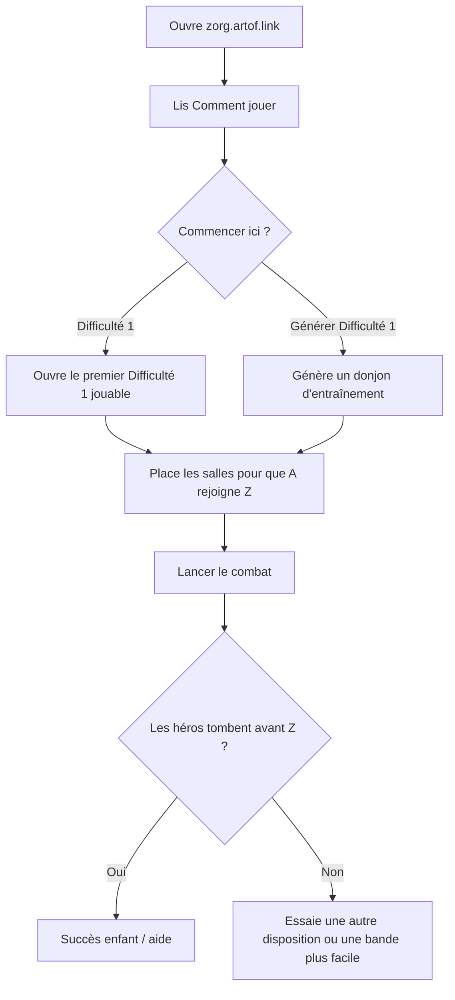

# Parcours personas (validation UX)

Ces parcours sont des **cas de validation UX** pour le Maker à [https://zorg.artof.link/?lang=fr](https://zorg.artof.link/?lang=fr). Ce ne sont pas de nouvelles règles de jeu.

> [!IMPORTANT]
> Les règles formelles restent dans [[GAME_SPEC]]. Si un parcours, un libellé de bouton, ou cette page n'est pas d'accord avec la spécification, **la spécification gagne**. N'invente pas la salle `C`, la durée de tir Gunner, ni le verrouillage de contrats ([[FR-18]], [[FR-22]], [[FR-4]]).

Les bandes de campagne écrite et de **Difficulté** sont les mêmes numéros que les fixtures. **Difficulté** est le mot enfant ; **Difficulty** reste un indice bilingue secondaire. La preuve moteur dans [[STATUS_LEDGER]] est encore Simulated, pas Live & Probed.

Compagnons : [[LEARN]] (images enfant) et [[PLAYER_GUIDE]] (guide complet). Écart premier jeu : [[FINDINGS]] CF-009. Locale FR optionnelle : `?lang=fr` ([[0007-i18n-fr-en]]).

## Comment utiliser ces parcours

1. Traite chaque id `J-*` comme une checklist stable, pas une demande de fonctionnalités pour inventer des règles.
2. Lance la checklist **manuelle** sur le Maker live ou un build local `apps/web`.
3. Les **sondes automatisées** optionnelles (`apps/web/e2e/journeys.spec.ts`, `pnpm probe:journeys`) affirment les mêmes critères de succès. Preuve **Simulated** seulement — pas Live & Probed, pas une promotion [[STATUS_LEDGER]]. Une fumée **FR** (`?lang=fr`) vérifie Comment jouer / Commencer ici en français ; validation UX seulement — la spécification gagne toujours.
4. Un parcours peut échouer en UX et rester correct en règles. C'est un problème Maker, pas un FR moteur.

## Index

| ID | Persona | Surface principale |
|---|---|---|
| J-KID | Enfant débutant (≈8) | Accueil + premier combat |
| J-HELPER | Aide adulte | Comment jouer + à quoi ressemble le succès |
| J-CAMPAIGN | Joueur de campagne | Progression Difficulté écrite |
| J-PRACTICE | Joueur d'entraînement | Générer → combattre vite |
| J-HONESTY | Honnêteté / ingénieur | Notes ledger / FR repliées |

---

## J-KID: Enfant débutant (≈8)

N'a jamais joué. A besoin de français simple, **une prochaine étape évidente**, et pas de jargon ingénieur sur le premier écran.

### But

Jouer un donjon facile et comprendre gagner vs perdre sans demander à un adulte de décoder FR / salle C / langage ledger.

### Chemin heureux

1. Ouvre [https://zorg.artof.link/?lang=fr](https://zorg.artof.link/?lang=fr).
2. Lis **Comment jouer** (quatre courtes étapes).
3. Appuie sur **Commencer ici — Difficulté 1** *ou* **Commencer ici — Générer Difficulté 1**.
4. Place les salles pour que **A** (départ des héros) rejoigne **Z** (Zorg). Une ligne suffit.
5. Appuie sur **Lancer le combat**.
6. Regarde. Tu gagnes si les héros tombent avant que quelqu'un entre dans Z. Tu perds si un héros atteint Z.

### Critères de succès

- Le premier écran mène avec Comment jouer et un bouton Commencer ici, pas de prose FR-4 / C / durée Gunner / ledger.
- L'enfant peut nommer le prochain appui sans lire un paragraphe.
- Après un combat, l'enfant peut dire « les héros doivent tomber avant Zorg » avec ses mots.
- Les notes ingénieur restent derrière un détail replié.

### Checklist de validation (manuelle)

- [ ] Le titre d'accueil est le nom du jeu ; l'accroche est du français simple.
- [ ] Comment jouer liste : choisir facile / Générer → placer A vers Z → Lancer le combat → héros tombent avant Z.
- [ ] **Apprendre les règles** ouvre la page enfant (`fr/learn.html`) avec images et sans soupe FR au premier écran.
- [ ] **Commencer ici — Difficulté 1** ouvre un niveau Difficulté 1 écrit jouable.
- [ ] **Commencer ici — Générer Difficulté 1** ouvre un donjon d'entraînement généré.
- [ ] Les notes Honnêteté / FR / C / Gunner / Simulated sont dans un bloc details replié.

---

## J-HELPER: Aide adulte

Aide un enfant. A besoin de savoir à quoi ressemble le succès et où sont les notes d'honnêteté.

### But

Guider sans inventer de règles. Pointer [[LEARN]] / [[PLAYER_GUIDE]] / cette page. La spécification gagne.

---

## J-CAMPAIGN: Joueur de campagne

Veut progresser dans les niveaux écrits par bande Difficulté. Les niveaux indisponibles (C / durée Gunner / non résolus) restent listés mais non jouables — pas de règles inventées.

---

## J-PRACTICE: Joueur d'entraînement

Veut **Générer** vite un donjon Difficulté 1–4 (`generateLevel`, Simulated). Ne remplace pas la campagne ([[NFR-5]]). Ne débloque pas [[FR-4]].

---

## J-HONESTY: Honnêteté / ingénieur

À l'aise avec le langage FR / ledger. Ce langage peut rester **replié / secondaire**. Pas de promotion [[STATUS_LEDGER]] depuis une page compagnon.

### Liens

- Ledger : [[STATUS_LEDGER]]
- Écarts : [[FINDINGS]]
- Décision i18n : [[0007-i18n-fr-en]]

Version anglaise : [journeys.html](../journeys.html).

## Cartographie FR (rappel)

| Parcours | IDs liés |
|---|---|
| J-KID / J-HELPER | [[FR-5]]–[[FR-8]], [[FR-12]], [[FR-43]] (idée gagner/perdre) ; lecture Maker = planificateur seulement — voir [[PLAYER_GUIDE]] |
| J-CAMPAIGN / J-PRACTICE | [[NFR-5]], [[FR-46]] ; pas [[FR-4]] / C / durée Gunner inventés |
| J-HONESTY | [[NFR-8]], [[STATUS_LEDGER]] |

## Hors périmètre

- Remplacer [[PLAYER_GUIDE]] ou [[GAME_SPEC]].
- Inventer salle `C`, durée Gunner, ou verrouillage [[FR-4]].
- Phase C (honesty / skills bilingues).
